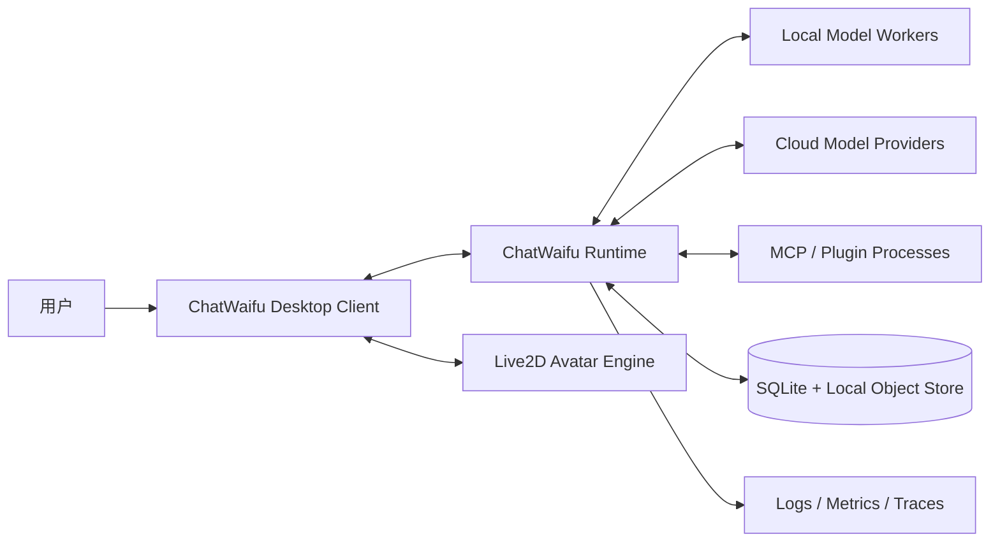
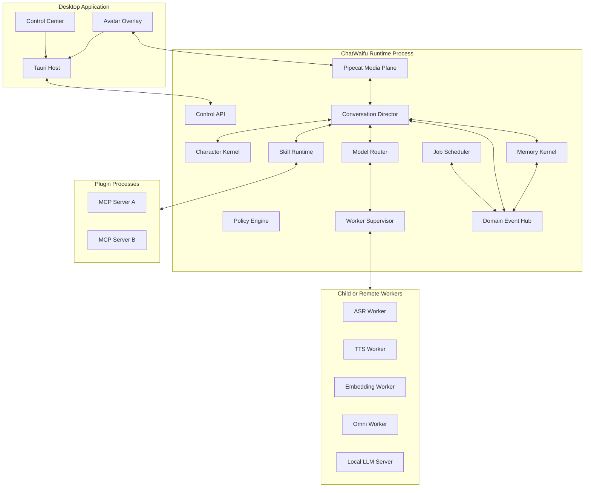

# ChatWaifu Next 架构设计文档

> 文档状态：Implementation Ready  
> 面向对象：Codex、核心开发者、前端开发者、模型适配开发者  
> 文档日期：2026-08-23  
> 架构形态：本地优先、模块化单体核心、独立模型 Worker、独立插件进程、事件驱动  
> 首选角色前端：React + TypeScript + Tauri 2 + Live2D Cubism SDK for Web  
> 首选实时媒体层：Pipecat + SmallWebRTC + RTVI  

---

## 0. 文档用途

这份文档是 ChatWaifu 全量重构的工程基线。Codex 应将它视为系统边界、协议、目录、职责和验收规则的权威来源，而不是一份仅供参考的概念稿。

本项目不是在旧 ChatWaifu 上继续叠功能。旧项目只保留产品概念、角色资源兼容经验和少量实验性实现思路。新系统应从空仓库开始，以明确的领域协议重建。

配套文档：

- `CHATWAIFU_NEXT_IMPLEMENTATION_PLAN.md`：分阶段实现顺序、任务清单、验收门槛。
- `CODEX_HANDOFF.md`：Codex 执行规则、工作流、首批任务和禁止事项。

---

## 1. 执行摘要

ChatWaifu Next 是一个本地优先的实时 AI 角色运行时。它需要同时支持：

1. 自然、可打断的实时语音对话。
2. 本地文本模型与云端强模型协同。
3. 传统 ASR + LLM + TTS 级联语音。
4. 云端原生 Speech-to-Speech 实时模型。
5. 本地 Omni 多模态模型。
6. 可安装、可权限控制、可取消的 Skills 与插件。
7. 可追溯、可更正、可遗忘的长期记忆。
8. 与具体模型解耦的人格、关系、情绪和主动行为。
9. Live2D 优先、未来可接 VRM 或 Unity 3D 的角色表现层。
10. 单用户桌面环境下足够轻量，同时为未来多设备部署保留接口。

系统的核心原则是：

> Pipecat 管理“怎么听、怎么说、怎么打断”；ChatWaifu Core 管理“她是谁、记得什么、会做什么、为什么此刻开口”。

---

## 2. 已审计旧项目及迁移结论

### 2.1 `cjyaddone/ChatWaifu`

旧 ChatWaifu 的主要形态是同步脚本：

```text
麦克风输入
  -> Vosk 识别完整句子
  -> ChatGPT/OpenAI 请求
  -> VITS 推理
  -> 写入 output.wav
  -> 阻塞播放
```

主要问题：

- ASR、LLM、TTS、角色选择、输入循环和播放逻辑耦合在同一文件。
- 中文、日文、英文通过复制脚本分支维护。
- 没有统一会话协议、生成 ID、取消令牌、事件记录和长期记忆。
- TTS 模型初始化与业务逻辑混合。
- 依赖非正式接口或过时模型调用方式。
- 无法可靠支持实时打断、流式输出、插件和多后端切换。

迁移结论：

- 不复制旧 Python 主循环。
- 不沿用旧消息格式。
- 可以保留角色设定、声音样本、文本清洗规则，但必须逐项审查许可证。
- 旧项目只作为产品历史和兼容测试样本。

### 2.2 上传的 `hikari_mirror-master.zip`

该项目已经尝试将 ASR、LLM、TTS、Action、Agent、Interaction 和 Unity 拆成不同进程，这是值得保留的方向。其主要端口为：

```text
ASR          8765
LLM          8766
Unity Relay  8767 / 8769
TTS          8768
Interaction  8770
Action       8771
Agent        8772
Web UI       8000
GPT-SoVITS   9880
```

其主要协议以字符串前缀传递：

```text
DATA:
QUESTION:
SAY:true
SAY:false
SWITCH_STATE
SWITCH_ACTION
Action:
Agent:
```

可复用的思想：

- 进程监督与模块启停面板。
- 流式 TTS 到客户端的方向。
- 用户开口后清空播放缓冲区的跨模块打断思路。
- Unity 高层动作、表情、视角、触摸和位置追踪协议。
- Agent 待机行为和主动状态机概念。
- WebSocket 日志查看器。
- ASR 自适应噪声门限实验。

必须重写的部分：

- 字符串前缀协议改为版本化类型事件。
- 全局 `say/generating` 布尔量改为 Session、Turn、Generation 状态机。
- 一个活动 Unity 客户端的限制改为按 Session 路由。
- 无帧头二进制音频改为带 `stream_id/sequence/pts/codec` 的媒体帧。
- 直接清理私有队列 `_queue` 改为可取消任务和 generation invalidation。
- `time.sleep()` 等阻塞调用不得出现在异步热路径。
- 巨型人格 Prompt 改为 Character Kernel 的可组合上下文。
- 硬编码端口、密钥和路径全部迁移到配置系统与 Secret Store。
- GPT-SoVITS 源码不得继续整体 vendoring，应作为独立 Worker 或外部服务适配。
- Action LLM 不再直接生成 Unity 原始 JSON，而是生成受能力清单约束的 `AvatarCue`。

### 2.3 旧 Unity 协议的保留方式

旧协议中有价值的概念包括：

- `Movement`：Idle、Talk、Think、Wave 等动作。
- `Expression`：Smile、Angry、Sad、Astonished、Wink 等表情。
- `NeedMove` 与 `MovePos`。
- `ClearAudioStream`。
- `BlendShapeStructList`。
- 触摸部位事件。
- `ViewIndex`。
- 角色位置和动画进度查询。
- 随机行为开关。

这些字段不能继续作为核心协议。它们应迁移到：

```text
AvatarCapabilityManifest
AvatarCue
AvatarTelemetry
AvatarInteractionEvent
LegacyUnityAdapter
```

`LegacyUnityAdapter` 只作为可选兼容模块，不进入 MVP 主路径。

---

## 3. 目标与非目标

### 3.1 产品目标

- 用户可随时开口，角色能在目标 200 ms 内停止旧音频。
- 角色在模型切换后仍保持基本一致的人格、语言风格和记忆。
- 本地可独立完成基础对话、角色语音、记忆和部分 Skills。
- 云端只在策略允许时接收必要上下文。
- Skills 可渐进加载，不向每轮模型暴露全部工具。
- 所有有副作用的行为具有权限、确认、审计和取消路径。
- 用户可查看、修改、删除和导出长期记忆。
- 前端可替换角色渲染器，不影响后端认知与会话系统。

### 3.2 第一版非目标

- 不做大规模多租户 SaaS。
- 不做跨地区 RTC 集群。
- 不让第三方插件在主 UI 中任意执行 JavaScript。
- 不把实时 PCM 帧经 MCP 传输。
- 不以某一个 Omni 模型作为唯一后端。
- 不把模型权重打进桌面安装包。
- 不在第一版实现完整 OS 级沙箱，先提供信任等级、进程隔离和策略门控。
- 不直接迁移旧代码中的全局状态和字符串协议。

---

## 4. 架构原则

### 4.1 模型是适配器，不是系统边界

任何 ASR、LLM、TTS、Realtime 或 Omni 模型都只能通过能力接口接入。Character、Memory、Skill 和 Avatar 不得 import 具体模型 SDK。

### 4.2 高频媒体与低频领域事件分离

PCM、视频帧、VAD 信号和 token delta 属于实时媒体平面。记忆提交、Skill 完成、关系变化和主动行为属于领域事件平面。两者采用不同保留策略和背压策略。

### 4.3 命令与事件分离

- Command 表示“请求发生某事”。
- Event 表示“某事已经发生”。

例如：

```text
Command: conversation.interrupt
Event:   conversation.interruption_requested
Event:   tts.cancelled
Event:   playback.queue_cleared
Event:   conversation.interrupted
```

### 4.4 取消必须端到端传播

打断不是简单把音量设为 0。它必须同时：

- 让当前 generation 失效。
- 取消 LLM 流。
- 取消 TTS 流。
- 清空未播放音频。
- 停止 Avatar Speech Layer。
- 标记实际已播放文本范围。
- 保留或取消后台 Skill，取决于执行策略。

### 4.5 “实际发生”优先于“模型生成”

长期记忆只能根据用户实际说出、角色实际播放、工具实际完成的事件建立。模型生成但未播放的文本不能视为共同经历。

### 4.6 本地优先，云端可解释

模型路由必须记录：

- 为什么选择某后端。
- 向云端发送了哪些上下文。
- 是否有本地替代方案。
- 使用成本和延迟。
- 是否触发回退。

### 4.7 渐进复杂度

第一版使用模块化单体和 SQLite。只有真实负载证明需要时才引入分布式消息队列、独立向量数据库或图数据库。

---

## 5. 系统上下文



---

## 6. 容器级架构



---

## 7. 推荐技术栈

### 7.1 前端与桌面

```text
React
TypeScript
Vite
Tauri 2
Official Live2D Cubism SDK for Web
Web Audio API
Pipecat Client JS + React bindings
Zustand
Zod
Vitest
Playwright
```

### 7.2 后端

```text
Python 3.12
uv workspace
FastAPI
Pipecat
Pydantic v2
AnyIO
SQLAlchemy 2
Alembic
SQLite WAL + FTS5
structlog
OpenTelemetry
pytest
```

### 7.3 工具与构建

```text
pnpm workspace
Cargo / Rust stable
Ruff
Pyright
ESLint
Prettier
GitHub Actions
JSON Schema code generation
```

版本策略：

- 在项目初始化当天锁定当前稳定版本。
- 使用 lockfile，不使用浮动生产依赖。
- Live2D 选择稳定的 Cubism 5 SDK for Web 版本，不跟随 alpha。
- 每次升级 Pipecat、Tauri、Live2D、Realtime Provider 时必须有独立 ADR 和回归测试。

---

## 8. Monorepo 结构

```text
chatwaifu-next/
├── apps/
│   ├── web/                         # React/Vite，共享 UI
│   └── desktop/                     # Tauri 2 宿主
│       └── src-tauri/
│
├── services/
│   └── runtime/
│       ├── src/chatwaifu_runtime/
│       │   ├── api/
│       │   ├── bootstrap/
│       │   ├── config/
│       │   ├── director/
│       │   ├── eventing/
│       │   ├── realtime/
│       │   ├── policy/
│       │   ├── scheduler/
│       │   ├── sessions/
│       │   └── supervisor/
│       ├── migrations/
│       └── tests/
│
├── packages/
│   ├── protocol-python/
│   ├── protocol-typescript/
│   ├── avatar-sdk/
│   ├── character/
│   ├── memory/
│   ├── skills/
│   ├── model-router/
│   ├── plugin-sdk-python/
│   └── plugin-sdk-typescript/
│
├── workers/
│   ├── asr-qwen3/
│   ├── asr-funasr/
│   ├── tts-qwen3/
│   ├── tts-gpt-sovits/
│   ├── embedding/
│   └── omni-minicpm/
│
├── adapters/
│   ├── openai-realtime/
│   ├── gemini-live/
│   ├── openai-compatible-llm/
│   ├── legacy-unity/
│   └── legacy-chatwaifu/
│
├── skills/
│   ├── builtin/
│   └── examples/
│
├── plugins/
│   └── examples/
│
├── characters/
│   └── default/
│       ├── character.yaml
│       ├── persona.md
│       ├── voice.yaml
│       ├── avatar.yaml
│       └── relationship-policy.yaml
│
├── models/
│   └── manifests/
│
├── schemas/
├── docs/
│   ├── adr/
│   ├── protocols/
│   └── operations/
│
├── tests/
│   ├── contract/
│   ├── e2e/
│   ├── latency/
│   └── fixtures/
│
├── pyproject.toml
├── pnpm-workspace.yaml
├── Cargo.toml
├── Makefile
└── README.md
```

禁止将大模型源码、权重、虚拟环境或编译产物提交到主仓库。

---

## 9. 领域协议

### 9.1 Event Envelope

所有可持久化事件使用统一信封：

```python
from datetime import datetime
from typing import Any, Literal
from uuid import UUID
from pydantic import BaseModel, Field

class EventEnvelope(BaseModel):
    event_id: UUID
    schema_version: str = "1.0"
    event_type: str

    session_id: UUID | None = None
    turn_id: UUID | None = None
    generation_id: UUID | None = None
    skill_run_id: UUID | None = None

    sequence: int | None = None
    occurred_at: datetime
    source: str

    correlation_id: UUID | None = None
    causation_id: UUID | None = None

    privacy: Literal[
        "public",
        "local",
        "private",
        "sensitive"
    ] = "private"

    payload: dict[str, Any] = Field(default_factory=dict)
```

规则：

- `event_id` 全局唯一。
- 同一 session 的需要排序事件必须有递增 `sequence`。
- `correlation_id` 串联一次用户请求产生的所有事件。
- `causation_id` 指向直接触发本事件的事件或命令。
- Payload 字段变化必须提升 schema version 或增加兼容解析。
- Consumer 必须通过 `event_id` 实现幂等。

### 9.2 Command Envelope

```python
class CommandEnvelope(BaseModel):
    command_id: UUID
    schema_version: str = "1.0"
    command_type: str
    issued_at: datetime
    issuer: str

    session_id: UUID | None = None
    turn_id: UUID | None = None
    generation_id: UUID | None = None
    correlation_id: UUID | None = None

    expected_revision: int | None = None
    payload: dict[str, Any] = Field(default_factory=dict)
```

### 9.3 必须定义的核心事件

```text
system.runtime_started
system.runtime_stopping
system.component_health_changed

session.created
session.closed
session.state_changed

user.speech_started
user.speech_progress
user.speech_stopped
user.transcript_partial
user.transcript_final
user.turn_committed

assistant.generation_started
assistant.text_delta
assistant.text_segment_committed
assistant.generation_cancelled
assistant.generation_completed

assistant.audio_stream_started
assistant.audio_chunk_queued
assistant.playback_started
assistant.playback_progress
assistant.playback_stopped
assistant.spoken_text_committed

conversation.interruption_requested
conversation.interrupted
conversation.recovered

skill.discovered
skill.activated
skill.run_started
skill.progress
skill.confirmation_requested
skill.run_completed
skill.run_failed
skill.run_cancelled

tool.call_started
tool.call_completed
tool.call_failed

memory.proposed
memory.committed
memory.superseded
memory.tombstoned
memory.recalled

character.state_changed
relationship.state_changed
avatar.cue_emitted
avatar.interaction_received

model.route_selected
model.worker_loaded
model.worker_unloaded
model.fallback_triggered
```

### 9.4 高频媒体帧

高频帧不进入 Event Store：

```python
class AudioFrameHeader(BaseModel):
    stream_id: UUID
    generation_id: UUID | None
    sequence: int
    pts_ms: int
    duration_ms: int
    codec: Literal["pcm_s16le", "opus"]
    sample_rate: int
    channels: int
    end_of_stream: bool = False
```

传输方式：

- 控制头用 JSON 或紧凑二进制头。
- 音频正文用 binary frame。
- 必须有大小上限和 sequence 检查。
- 迟到且 generation 已失效的帧直接丢弃。

---

## 10. Runtime 内部事件总线

第一版采用进程内 Event Hub：

- 基于 AnyIO memory object stream。
- 每个订阅者有独立有界队列。
- 支持按 `event_type`、`session_id` 和标签过滤。
- 关键事件先落 SQLite outbox，再投递。
- UI 事件可通过 WebSocket 或 SSE 派生。
- 高频 token delta 和音频 progress 可设置采样率，不全部持久化。

建议接口：

```python
class EventHub(Protocol):
    async def publish(self, event: EventEnvelope) -> None: ...
    def subscribe(self, subscription: Subscription) -> AsyncIterator[EventEnvelope]: ...

class EventStore(Protocol):
    async def append(self, event: EventEnvelope) -> None: ...
    async def read_stream(
        self,
        *,
        session_id: UUID,
        after_sequence: int | None = None,
    ) -> list[EventEnvelope]: ...
```

背压策略：

- `critical`：不得丢失，写盘后重试。
- `normal`：有界等待。
- `ephemeral`：队列满时允许合并或丢弃旧值。

不得使用无限队列。

---

## 11. Session、Turn 与 Generation 状态机

### 11.1 Session 状态

```text
CREATED
CONNECTING
READY
DEGRADED
RECOVERING
CLOSING
CLOSED
```

### 11.2 Conversation 状态

```text
IDLE
LISTENING
COMMITTING_USER_TURN
PLANNING
GENERATING
SPEAKING
INTERRUPTING
RECOVERING
```

### 11.3 Turn

一次 User Turn 包含：

- speech start/end。
- partial transcript。
- final transcript。
- scene snapshot 引用。
- 当前 Skill、Memory 和 Character Context。
- 最终 commit 时间。

### 11.4 Generation

每次角色响应必须创建新的 `generation_id`。所有 LLM delta、TTS chunk、Avatar speech cue 和 playback ACK 都带该 ID。

打断时：

1. 将 generation 标记为 `CANCELLING`。
2. 取消所有持有该 token 的任务。
3. 向 Pipecat 发送 interruption。
4. 向 TTS Worker 发 cancel。
5. 清空客户端未播放音频。
6. Avatar 停止 Speech Layer。
7. 任何迟到帧因 generation 无效被丢弃。
8. 收集各组件 ACK。
9. 标记 generation `CANCELLED`。
10. 产生 `assistant.spoken_text_committed`，只记录实际播放部分。

### 11.5 前台与后台任务

用户打断不应一刀切取消所有任务。

- Foreground generation：必须取消。
- Foreground Skill：默认暂停或取消，由 Skill manifest 决定。
- Background Skill：继续运行，但不能未经许可自动抢占话筒。
- Prospective Task：继续存在。
- Memory consolidation：继续后台运行。

---

## 12. Pipecat 实时媒体平面

Pipecat 负责：

- WebRTC 音频和可选视频传输。
- 麦克风设备与播放媒体通道。
- VAD。
- Smart Turn。
- Barge-in。
- STT、TTS 和 realtime service 接入。
- Frame processor 管线。
- RTVI 客户端事件。

Pipecat 不负责：

- 长期记忆真相。
- Character Canon。
- Plugin 权限。
- Skill 业务生命周期。
- 数据库迁移。
- 主动行为策略。

### 12.1 本地默认传输

第一版使用 SmallWebRTC：

- 浏览器和桌面客户端与本地 Runtime 点对点通信。
- 控制面通过 FastAPI 获取连接参数。
- 未来如需远程房间，可增加 LiveKit Transport Adapter，但不得修改领域协议。

### 12.2 Pipeline 结构

```text
Transport Input
  -> Audio Normalizer
  -> VAD / Turn Analyzer
  -> User Speech Event Processor
  -> Speech Backend Adapter
  -> Conversation Director Bridge
  -> Response Backend
  -> Output Audio Gate
  -> Transport Output
```

### 12.3 打断

- 默认使用 Pipecat interruption 机制停止下游输出。
- ChatWaifu 仍需额外 generation invalidation，防止 Worker 或前端迟到帧复活旧回答。
- 打断延迟从客户端检测到旧声音停止进行端到端计时。

---

## 13. Speech Backend 抽象

```python
from typing import AsyncIterator, Protocol

class SpeechCapabilities(BaseModel):
    audio_input: bool = True
    text_input: bool = True
    image_input: bool = False
    video_input: bool = False
    audio_output: bool = False
    text_output: bool = True
    streaming_input: bool = True
    streaming_output: bool = True
    full_duplex: bool = False
    tool_calling: bool = False
    custom_voice: bool = False
    reliable_transcript: bool = True
    local: bool = True
    interruptible: bool = True

class ConversationBackend(Protocol):
    @property
    def capabilities(self) -> SpeechCapabilities: ...

    async def open(self, context: "SessionContext") -> None: ...
    async def push_audio(self, frame: "AudioInputFrame") -> None: ...
    async def push_video(self, frame: "VideoInputFrame") -> None: ...
    async def push_text(self, text: str) -> None: ...
    async def patch_context(self, patch: "ContextPatch") -> None: ...
    async def interrupt(self, generation_id: UUID) -> None: ...
    async def close(self) -> None: ...
    def events(self) -> AsyncIterator["BackendEvent"]: ...
```

必须支持四种实现。

### 13.1 Character Cascade

```text
Streaming ASR
  -> Conversation Director
  -> Text LLM / Skills / Memory
  -> Character TTS
  -> Audio + Boundary + Avatar Cue
```

默认生产模式，适合：

- 固定角色声线。
- 精确工具调用。
- 长期记忆。
- 复杂推理。
- 本地离线。
- 字幕和审计。

### 13.2 Half Cascade

```text
Native Audio Understanding
  -> Text / Prosody Metadata
  -> Director / Skills / Memory
  -> Character TTS
```

适合保留用户音色情绪线索，同时维持角色自己的声线。

### 13.3 Cloud Realtime

```text
Audio / Image / Video
  -> Cloud Realtime Model
  -> Audio + Text + Tool Calls
```

适合自然闲聊和低延迟。必须额外维护：

- Shadow transcript。
- Domain event mirror。
- Tool state。
- Memory state。
- Character state。
- Reconnect snapshot。

云端 Session 不能成为唯一真相源。

### 13.4 Local Omni

```text
Local audio/video/text streams
  -> Local Omni Worker
  -> Concurrent speech/text output
```

适合离线、隐私和实验性全双工。必须可随时退回 Cascade。

---

## 14. 语音模型初始策略

模型名不能写死在业务代码中。以下只是首轮适配候选：

### ASR

- Qwen3-ASR 0.6B：快速流式基线。
- Qwen3-ASR 1.7B：质量基线和最终校正。
- FunASR / SenseVoice：兼容现有经验，提供事件或情绪信号。
- faster-whisper：稳定对照组。
- sherpa-onnx：未来移动端或轻量客户端。

注意：Qwen3-ASR 的流式实现路径与时间戳能力需要按官方后端限制测试，不能假设所有部署方式都同时支持流式与 timestamps。

### TTS

- Qwen3-TTS 0.6B：低资源流式基线。
- Qwen3-TTS 1.7B：高质量、克隆、Voice Design 试验。
- GPT-SoVITS：兼容已有角色音色资产。
- IndexTTS：中文和情绪表现对照。
- CosyVoice：另一条成熟流式基线。

### Cloud Realtime

- OpenAI Realtime Adapter。
- Gemini Live Adapter。

### Local Omni

- MiniCPM-o 4.5 Adapter。
- 未来的 Qwen Omni、Moshi 或其他后端通过同一接口接入。

### 14.1 Shadow Transcript

任何 audio-in/audio-out 模式都建议运行影子转写：

- 用于字幕。
- 用于记忆。
- 用于 Skill 路由。
- 用于调试和审计。
- 用于模型切换和会话恢复。

影子转写不应阻塞主语音链路。

---

## 15. Model Worker 协议

Heavy model 不加载进 Runtime 主进程。每个 Worker 使用独立 Python 环境和进程。

### 15.1 Worker 控制 API

```text
GET  /v1/health
GET  /v1/capabilities
GET  /v1/metrics
POST /v1/load
POST /v1/unload
POST /v1/jobs
GET  /v1/jobs/{job_id}
POST /v1/jobs/{job_id}/cancel
WS   /v1/stream/asr
WS   /v1/stream/tts
WS   /v1/stream/omni
```

### 15.2 安全

- 只绑定 loopback 或 Unix domain socket。
- Runtime 启动 Worker 时注入随机短期 token。
- Worker 不读取完整用户配置。
- Worker 只获得完成任务需要的输入。
- 不在日志中输出参考音频、Prompt、API Key 或原始敏感文本。

### 15.3 Worker Manifest

```yaml
id: qwen3-tts-0.6b-base
kind: tts
adapter_version: "1.0"

modalities:
  input: [text, reference_audio]
  output: [audio, word_boundary]

capabilities:
  streaming: true
  voice_clone: true
  voice_design: false
  custom_voice: true
  interruptible: true

languages: [zh, en, ja, ko]

resource:
  devices: [cuda, cpu]
  estimated_vram_mb: 6000
  estimated_ram_mb: 8000
  exclusive_gpu: false

privacy:
  local: true
  stores_input: false

license:
  id: apache-2.0
  review_required: true
```

### 15.4 Supervisor

Worker Supervisor 负责：

- 启动、停止、重启。
- 健康检查。
- 崩溃退避。
- 显存预算。
- 依赖能力匹配。
- 懒加载与闲置卸载。
- 版本和 license 状态检查。
- 记录 Worker 生命周期事件。

不得通过固定端口硬编码 Worker。Runtime 应选择空闲端口或 local socket，并通过启动握手获取地址。

---

## 16. Model Router

Model Router 输入：

```text
任务类型
需要的模态
隐私等级
是否固定角色声线
工具调用要求
上下文长度
延迟预算
网络状态
成本预算
Worker 健康
显存状态
用户偏好
```

输出：

```python
class RouteDecision(BaseModel):
    provider_id: str
    model_id: str
    backend_kind: str
    reason_codes: list[str]
    fallback_chain: list[str]
    cloud_context_policy: str
    estimated_cost: float | None
```

参考评分：

```text
score =
  capability_match
+ privacy_fit
+ latency_fit
+ quality_fit
+ voice_identity_fit
+ availability
- cost_penalty
- load_penalty
- context_egress_penalty
```

硬规则优先于分数：

- `local_only` 数据不得发云端。
- 必须固定角色声线时，不能选无自定义声线的原生 Realtime，除非用户显式允许。
- 有副作用工具调用必须选择支持结构化工具或委派给 Skill Backbrain。

Pipecat 的 `LLMSwitcher` 和 `ServiceSwitcher` 可用于媒体管线内切换，但最终路由决策属于 ChatWaifu Model Router。

---

## 17. 双脑协同

### 17.1 Speech Frontbrain

负责：

- 持续听取。
- backchannel。
- 简短确认。
- 打断和轮次节奏。
- 情绪反馈。
- 用角色声音表达最终结果。

### 17.2 Cognitive Backbrain

负责：

- 复杂推理。
- Skills。
- 搜索与工具。
- 长期记忆。
- 视觉深度分析。
- 本地和云端强模型路由。

内部元工具：

```python
async def delegate_reasoning(
    task: str,
    privacy: str,
    required_capabilities: list[str],
    context_refs: list[str],
    latency_class: str,
) -> ReasoningJobHandle:
    ...
```

Backbrain 返回结构化内容，不直接拥有角色话筒：

```text
facts
conclusion
uncertainties
recommended_actions
source_refs
memory_candidates
```

Frontbrain 或 Character Cascade 再将结果转为角色语气。

---

## 18. Skill 与 Plugin 架构

### 18.1 定义

- Tool：一个原子动作。
- MCP Server：发布工具、资源和可选 UI 的协议端点。
- Skill：完成某类目标的方法和流程。
- Plugin：可安装包，可包含 Skills、MCP Server、资源、声明式 UI 和 Avatar 能力。

### 18.2 Agent Skills 兼容

每个 Skill 至少包含：

```text
skill-name/
├── SKILL.md
├── chatwaifu.yaml
├── scripts/
├── references/
├── assets/
└── tests/
```

`SKILL.md` 遵循 Agent Skills 规范，使用渐进加载：

1. 启动时只读取 name 和 description。
2. 激活时读取 SKILL.md 正文。
3. 需要时读取 references、scripts 和 assets。

### 18.3 ChatWaifu 扩展 Manifest

```yaml
id: music-companion
version: 1.0.0

triggers:
  intents:
    - 陪我听歌
    - 放点适合现在心情的音乐
  events:
    - media.track_changed

execution:
  mode: background-capable
  latency_class: interactive
  interruptible: true
  resume_after_interruption: true
  singleton: true
  timeout_seconds: 7200

permissions:
  required:
    - media.library.read
    - media.playback.write
  optional:
    - memory.music_preferences.read
    - memory.shared_experience.write

network:
  policy: allowlist
  domains: []

memory:
  read_scopes:
    - user/global/preferences
  write_scopes:
    - skill/music-companion
    - character/{character_id}/user/{user_id}

models:
  requires: [tool_calling]
  prefers: [emotion_understanding]

avatar:
  allowed_cues:
    - listening
    - rhythm_sway
    - delighted
```

### 18.4 Skill 发现与激活

```text
输入或环境事件
  -> metadata keyword/embedding recall
  -> Top-K candidate list
  -> policy filter
  -> model or deterministic selector
  -> activate_skill
  -> load SKILL.md
  -> project only allowed tools
```

实时模型不应看到全部工具。默认只暴露元工具：

```text
discover_skills
activate_skill
start_skill
get_skill_run
cancel_skill_run
memory_search
request_confirmation
```

### 18.5 Skill Run 状态机

```text
CREATED
ACTIVATING
RUNNING
WAITING_FOR_TOOL
WAITING_FOR_CONFIRMATION
PAUSED
SUCCEEDED
FAILED
CANCELLING
CANCELLED
EXPIRED
```

### 18.6 SkillResult

```python
class SkillResult(BaseModel):
    status: str
    data: dict
    spoken_summary: str | None = None
    ui_cards: list[dict] = []
    avatar_cues: list[dict] = []
    memory_proposals: list[dict] = []
    prospective_tasks: list[dict] = []
    provenance: list[str] = []
```

Skill 不得直接生成最终角色音频。

### 18.7 MCP 使用边界

MCP 适合：

- 工具调用。
- 应用数据资源。
- 插件能力发现。
- 后期隔离 UI。

MCP 不适合：

- PCM 音频帧。
- Live2D 60 FPS 参数。
- Runtime 内部 Event Bus。
- 低延迟 VAD 信号。

### 18.8 Plugin 进程隔离

第一版：

- Plugin 作为 stdio 或 loopback MCP 子进程。
- 独立工作目录。
- 清理环境变量。
- 只注入必要 secret handle。
- 有 CPU、内存和运行时间限制的软门控。
- 网络和文件权限由 Policy Engine 决策。
- 插件分为 `builtin/trusted/untrusted/disabled`。

未来可增加 OS sandbox，但不能在 UI 中声称第一版具备强安全隔离。

### 18.9 Plugin UI

第一版只允许声明式 UI Card：

```text
text
markdown
list
table
button
progress
image reference
form with approved fields
```

不允许第三方 JavaScript 注入主 React 树。后期可评估 MCP Apps，并放入隔离 webview 或 iframe。

---

## 19. Memory Kernel

### 19.1 核心原则

记忆不是聊天记录向量化。Memory Kernel 使用：

```text
Append-only Event Store
+ Structured Memory Records
+ FTS
+ Vector Retrieval
+ Entity/Time Retrieval
+ Deterministic Commit Rules
```

### 19.2 记忆分类

#### Working Memory

当前会话、当前 Skill、最近几轮、正在等待的工具、未说完意图和场景快照。生命周期短。

#### Core Memory

始终注入的少量高价值信息：用户称呼、重要边界、长期项目、角色身份和当前关系定位。

#### Semantic Memory

相对稳定的事实、偏好、设备、项目状态。

#### Episodic Memory

带时间、地点、参与者、情绪和结果的共同经历。

#### Procedural Memory

用户纠正过的表达方式、成功工作流和 Skill 参数偏好。

#### Relationship Memory

熟悉度、信任、称呼、共同习惯、关系边界、未解决矛盾和共同仪式。

#### Prospective Memory

提醒、承诺、待办、条件触发行为和下次继续的话题。

#### Character Self Memory

角色自身 Canon、经历和世界观。必须与用户记忆分开。

### 19.3 MemoryRecord

```python
class MemoryRecord(BaseModel):
    memory_id: UUID
    namespace: str
    kind: str

    subject_id: str | None
    predicate: str | None
    value: dict | str | int | float | bool | None
    text: str

    source_event_ids: list[UUID]
    observed_at: datetime
    valid_from: datetime | None
    valid_to: datetime | None

    confidence: float
    importance: float
    sensitivity: str

    state: str
    supersedes: UUID | None
    created_at: datetime
    updated_at: datetime
```

### 19.4 命名空间

```text
user/{user_id}/global
character/{character_id}/self
character/{character_id}/user/{user_id}
world/{world_id}/shared
skill/{skill_id}/user/{user_id}
session/{session_id}
```

### 19.5 写入管线

```text
Raw Event
  -> Episode Segmenter
  -> Candidate Extractor
  -> Entity Resolver
  -> Existing Memory Comparison
  -> ADD / UPDATE / SUPERSEDE / CONTRADICT / IGNORE
  -> Sensitivity Classifier
  -> MemoryProposal
  -> Deterministic Committer
```

LLM 只能提出 proposal：

```python
class MemoryProposal(BaseModel):
    proposal_id: UUID
    operation: Literal[
        "add", "update", "supersede", "contradict", "forget", "ignore"
    ]
    candidate: MemoryRecordDraft | None
    target_memory_id: UUID | None
    evidence_event_ids: list[UUID]
    confidence: float
    rationale: str
```

Committer 必须检查：

- 证据是否存在。
- 命名空间权限。
- 敏感性。
- 冲突和重复。
- 用户是否显式要求记住或忘记。
- Candidate 是否来自未实际播放的角色文本。

### 19.6 “实际说出”的记录

必须区分：

```text
assistant.text_generated
assistant.audio_queued
assistant.audio_played
assistant.spoken_text_committed
```

优先使用 TTS word/phoneme boundary 与客户端 audio clock 计算实际播放范围。没有 boundary 时使用保守的句段 ACK，宁可少记，不可把未说出的内容当作共同事实。

### 19.7 检索

```text
User Input + Active Skill + Scene + Character State
  -> Query Planner
  -> FTS Search
  -> Vector Search
  -> Entity Search
  -> Temporal Search
  -> Validity / Sensitivity Filter
  -> Reranker
  -> Context Packager
```

建议初始分数：

```text
0.30 semantic relevance
0.20 lexical relevance
0.15 entity relation
0.15 temporal relevance
0.10 importance
0.10 task relevance
```

分数只是候选排序，不替代权限和有效期过滤。

### 19.8 Context Packet

```python
class MemoryContextPacket(BaseModel):
    pinned_facts: list[MemoryExcerpt]
    recent_episode: list[MemoryExcerpt]
    relevant_memories: list[MemoryExcerpt]
    open_commitments: list[MemoryExcerpt]
    relationship_context: list[MemoryExcerpt]
    provenance_ids: list[UUID]
    token_budget_used: int
```

### 19.9 遗忘与删除

- 逻辑删除：MemoryRecord tombstone。
- 来源事件可按用户要求删除或匿名化。
- 向量索引必须同步删除。
- 导出文件不得包含已经遗忘的内容。
- 如果某记忆已发往云端，UI 需要说明本地删除无法撤回既有网络传输。

### 19.10 数据库表

```text
events
sessions
turns
generations
playback_segments
memories
memory_sources
memory_proposals
memory_embeddings
entities
entity_aliases
entity_edges
episodes
relationship_states
prospective_tasks
skill_runs
tool_calls
model_runs
plugin_installations
permission_grants
outbox
```

SQLite：

- `PRAGMA journal_mode=WAL`。
- `PRAGMA foreign_keys=ON`。
- 明确 busy timeout。
- 所有 migration 通过 Alembic。
- FTS5 存储可检索文本。
- 向量层提供接口，初始可使用 SQLite 扩展或进程内索引，但不得写死实现。

---

## 20. Character Kernel

### 20.1 文件布局

```text
characters/default/
├── character.yaml
├── persona.md
├── voice.yaml
├── avatar.yaml
├── relationship-policy.yaml
├── lexicon.yaml
└── assets/
```

### 20.2 Character Canon

`persona.md` 保存固定设定，但不应包含用户私人资料。用户资料来自 Memory Context。

`character.yaml`：

```yaml
id: default-character
name: Hikari
languages: [zh, ja, en]

style:
  verbosity: adaptive
  humor: light
  directness: 0.7
  warmth: 0.65

boundaries:
  never_claim_physical_actions_not_observed: true
  disclose_uncertainty: true
  avoid_fake_memories: true
```

### 20.3 CharacterState

```python
class CharacterState(BaseModel):
    mood_valence: float
    arousal: float
    energy: float
    attention: float
    trust: float
    playfulness: float
    current_activity: str
    last_updated_at: datetime
```

状态由确定性 reducer 更新。LLM 可以提出影响，但不能直接写入任意数值。

### 20.4 RelationshipState

```text
familiarity
trust
preferred_distance
shared_rituals
sensitive_topics
unresolved_promises
recent_tension
interaction_frequency
```

更新需有惯性、上限、时间衰减和事件证据。

### 20.5 Prompt Compiler

每次生成构造：

```text
System Safety and Product Policy
Character Canon
Current Character State
Relationship Context
Memory Context Packet
Active Skill Instructions
Current Scene Snapshot
Conversation Window
Tool/Model Capabilities
```

不得将数据库全部 dump 进 Prompt。

### 20.6 Avatar Cue Planner

Character Kernel 输出高层语义 Cue：

```python
class AvatarCue(BaseModel):
    cue_id: UUID
    generation_id: UUID | None
    kind: Literal[
        "state", "expression", "motion", "gaze", "speech", "override"
    ]
    name: str
    intensity: float = 1.0
    start_anchor: str = "immediate"
    duration_ms: int | None = None
    priority: int = 50
    interruptible: bool = True
    metadata: dict = {}
```

LLM 不得直接输出 Live2D parameter 数值。

---

## 21. 前端架构与 Live2D 决策

### 21.1 最终选择

```text
UI: React + TypeScript + Vite
Desktop Shell: Tauri 2
Avatar: Official Live2D Cubism SDK for Web
Realtime Client: Pipecat Client + React bindings
Audio: Web Audio API
State: Zustand
Validation: Zod
```

### 21.2 为什么不是“Live2D 做整个前端”

Live2D 只负责角色渲染。React 负责：

- 字幕。
- 聊天历史。
- 设备设置。
- 模型管理。
- 记忆管理。
- Skill 与插件管理。
- 权限确认。
- 日志与调试。

这种边界可避免角色渲染逻辑吞掉整个应用。

### 21.3 为什么首选 Live2D

- 二次元角色表现成熟。
- 表情和微动作更适合陪伴型角色。
- 相比完整 3D 场景资源占用低。
- 透明桌面宠物形态自然。
- 模型、美术和动作生态较成熟。
- Web SDK 可与 React/Tauri 共用同一代码路径。
- 未来可通过 AvatarRenderer 接口增加 VRM 或 Unity。

### 21.4 Live2D 版本与许可

- 使用官方 Cubism SDK for Web 的稳定发布版。
- 不依赖非官方 wrapper 作为核心地基。
- Cubism Core 不在 GitHub 公开，需要从官方 SDK 获得。
- MotionSync Web 需要官方包中的 MotionSync Core。
- SDK 分发、模型分发和商业使用在发布前必须单独做许可证审查。

### 21.5 双窗口

#### Avatar Overlay

- 透明、无边框、可置顶。
- Live2D Canvas。
- 字幕气泡。
- 监听、思考、说话和离线状态。
- 可拖动和可选鼠标穿透。
- 点击命中区域产生 AvatarInteractionEvent。

#### Control Center

- 模型与 Worker。
- 角色与声线。
- 麦克风、扬声器和摄像头。
- 记忆查看、编辑、删除和导出。
- Skill 与 Plugin。
- 权限和隐私。
- 日志、trace 和延迟。
- 更新和诊断。

macOS 透明 WebView 可能需要私有 API 配置，因此 App Store 构建与桌宠构建应允许不同的发行 profile。

### 21.6 AvatarRenderer 接口

```typescript
export interface AvatarRenderer {
  load(manifest: AvatarManifest): Promise<void>;
  unload(): Promise<void>;

  applyCue(cue: AvatarCue): void;
  setState(state: AvatarRuntimeState): void;
  setAudioSource(source: MediaStreamAudioSourceNode | AudioNode): void;

  hitTest(x: number, y: number): AvatarHitResult[];
  resize(width: number, height: number, dpr: number): void;
  dispose(): void;
}
```

实现：

```text
Live2DAvatarRenderer       MVP
LegacyUnityAvatarRenderer  兼容层
VRMAvatarRenderer          后续
```

### 21.7 Render Loop

Live2D render loop 独立于 React：

```text
React
  -> high-level command
AvatarController
  -> cue scheduling
Live2D Engine
  -> requestAnimationFrame 60 FPS
```

禁止把每帧参数放入 Zustand 或 React state。

### 21.8 动画层

```text
Layer 0: Autonomic
         breathing, blinking, physics

Layer 1: Attention
         gaze, listening, thinking

Layer 2: Speech
         mouth, jaw, speaking micro-motion

Layer 3: Emotion
         happy, curious, worried, embarrassed

Layer 4: Gesture
         nod, tilt, wave, lean

Layer 5: Skill
         music sway, celebration, task-specific motion

Layer 6: Override
         interruption, alert, emergency reset
```

### 21.9 Avatar Capability Manifest

```yaml
id: hikari-live2d
renderer: live2d-web
model: assets/hikari.model3.json

expressions:
  neutral: exp/neutral.exp3.json
  happy: exp/happy.exp3.json
  curious: exp/curious.exp3.json
  worried: exp/worried.exp3.json

motions:
  idle: Idle
  talk: Talk
  think: Think
  nod: Gesture/Nod
  wave: Gesture/Wave
  head_tilt: Gesture/HeadTilt

parameters:
  mouth_open: ParamMouthOpenY
  mouth_form: ParamMouthForm
  eye_x: ParamEyeBallX
  eye_y: ParamEyeBallY

hit_areas:
  - name: head
    action: touched_head
  - name: body
    action: touched_body

features:
  motion_sync: true
  eye_tracking: true
  touch: true
```

### 21.10 口型

优先级：

```text
TTS native viseme
  -> phoneme/word boundary
  -> MotionSync from actual playback audio
  -> Web Audio analyser
  -> volume-only mouth open fallback
```

口型必须绑定实际播放的音频时钟。不能根据已生成文字预估，因为缓冲、网络、停顿和打断会造成漂移。

Web Audio 建议：

```text
Pipecat remote audio track
  -> MediaStreamAudioSourceNode
  -> analyser / motion sync branch
  -> GainNode
  -> AudioContext destination
```

确保只播放一次，不能同时让 `<audio>` 元素和 AudioContext 各自输出。

### 21.11 Avatar Interaction

前端点击或触摸产生：

```python
class AvatarInteractionEvent(BaseModel):
    interaction_id: UUID
    session_id: UUID
    character_id: str
    kind: str
    hit_area: str | None
    local_position: tuple[float, float] | None
    occurred_at: datetime
```

必须经过 Character Policy，再决定是否回应，不直接拼成 Prompt 字符串。

---

## 22. 前端状态划分

### 22.1 Durable UI State

- 用户设置。
- 窗口位置。
- 角色选择。
- 设备偏好。
- 插件启用状态。

### 22.2 Session State

- connection state。
- active session。
- active generation。
- current transcript。
- current skill runs。
- current avatar state。

### 22.3 Ephemeral Render State

- mouth weight。
- eye positions。
- animation blend。
- audio level。

Ephemeral Render State 不进入 React global store。

### 22.4 前后端事件

Runtime 到前端：

```text
rt.session.state
rt.transcript.partial
rt.transcript.final
rt.assistant.text_delta
rt.playback.state
rt.skill.progress
rt.avatar.cue
rt.permission.request
rt.worker.health
```

前端到 Runtime：

```text
cmd.session.start
cmd.session.stop
cmd.conversation.interrupt
cmd.text.send
cmd.device.update
cmd.permission.respond
cmd.skill.cancel
cmd.avatar.interaction
```

---

## 23. API 面

### 23.1 HTTP Control API

```text
GET  /v1/runtime/health
GET  /v1/runtime/version
GET  /v1/config
PATCH /v1/config

POST /v1/sessions
GET  /v1/sessions/{id}
DELETE /v1/sessions/{id}
POST /v1/sessions/{id}/interrupt
POST /v1/sessions/{id}/text

GET  /v1/characters
GET  /v1/characters/{id}
POST /v1/characters/{id}/activate

GET  /v1/models
POST /v1/models/{id}/load
POST /v1/models/{id}/unload

GET  /v1/skills
POST /v1/skills/{id}/activate
GET  /v1/skill-runs
POST /v1/skill-runs/{id}/cancel

GET  /v1/memories
POST /v1/memories
PATCH /v1/memories/{id}
DELETE /v1/memories/{id}
POST /v1/memories/export

GET  /v1/plugins
POST /v1/plugins/install
POST /v1/plugins/{id}/enable
POST /v1/plugins/{id}/disable
DELETE /v1/plugins/{id}
```

### 23.2 WebRTC / RTVI

- 音频、视频和实时数据走 Pipecat transport。
- 控制事件与客户端标准事件通过 RTVI 映射。
- Domain Event 不直接等同 RTVI message，需 adapter 层。

### 23.3 Event Stream

Control Center 使用 WebSocket 或 SSE 订阅低频事件与日志。

### 23.4 Local Authentication

- Runtime 启动时生成 session secret。
- Tauri 通过受控 IPC 获取。
- 浏览器远程访问默认关闭。
- 开启 LAN 时必须显式设置认证和 TLS。

---

## 24. 配置系统

配置层级：

```text
Compiled Defaults
  < System Config
  < User Config
  < Character Config
  < Session Overrides
```

配置文件：

```text
config/default.toml
config/platform/{windows,macos,linux}.toml
~/.chatwaifu/config.toml
characters/{id}/*.yaml
```

Secrets：

- 桌面端使用 OS Keychain。
- Runtime 只接收短期 secret handle 或必要值。
- API Key 不写进 YAML、日志、数据库明文字段或 crash dump。

---

## 25. 安全、隐私与权限

### 25.1 数据等级

```text
PUBLIC
LOCAL
PRIVATE
SENSITIVE
```

### 25.2 Cloud Egress Policy

每次向云端发送前创建：

```python
class EgressDecision(BaseModel):
    allowed: bool
    provider: str
    fields_included: list[str]
    fields_removed: list[str]
    reason_codes: list[str]
    user_confirmation_required: bool
```

### 25.3 Tool Permission

权限最少细化到：

```text
filesystem.read
filesystem.write
calendar.read
calendar.write
messages.send
browser.control
camera.observe
microphone.raw
memory.read
memory.write
media.control
network.external
system.command
```

### 25.4 确认门

必须确认：

- 发送消息。
- 创建或删除外部数据。
- 执行付款。
- 删除文件。
- 运行系统命令。
- 首次向新域名发送敏感数据。

### 25.5 日志脱敏

默认不记录：

- API Key。
- 原始声纹参考音频。
- 完整敏感 Prompt。
- 人脸图片。
- 长期记忆中的敏感值。

日志中使用 event ID、hash 和简化摘要。

---

## 26. Observability

### 26.1 Trace

一次用户轮次使用同一 `correlation_id`，串联：

```text
user speech
ASR
memory retrieval
skill routing
LLM
TTS
playback
avatar cues
memory proposals
```

### 26.2 指标

```text
speech.user_end_to_first_audio_ms
speech.interruption_to_silence_ms
speech.false_barge_in_rate
speech.missed_turn_rate
asr.partial_latency_ms
asr.final_latency_ms
llm.first_token_ms
tts.first_chunk_ms
playback.buffer_ms
skill.success_rate
skill.cancel_latency_ms
memory.proposal_precision
memory.false_recall_rate
model.fallback_rate
worker.crash_count
avatar.frame_time_ms
```

### 26.3 日志

结构化 JSON：

```json
{
  "level": "info",
  "event": "model.route_selected",
  "session_id": "...",
  "turn_id": "...",
  "generation_id": "...",
  "provider": "local-llm",
  "reason_codes": ["local_preferred", "tool_calling_required"]
}
```

### 26.4 用户可见诊断

Control Center 提供：

- 当前 Pipeline。
- 当前模型。
- ASR/TTS/LLM 延迟。
- Worker 健康。
- 最近一次 fallback。
- 最近一次权限拦截。
- 语音 loopback 测试。

---

## 27. 可靠性与恢复

### 27.1 Worker 崩溃

- Supervisor 标记 unhealthy。
- 当前 job 失败并产生结构化错误。
- Model Router 选择 fallback。
- 用户收到自然但诚实的降级提示。
- 指数退避重启。

### 27.2 前端断开

- Runtime 停止向该客户端排队音频。
- Session 可进入短暂 `RECOVERING`。
- 重连后发送状态快照，不重播旧音频。
- 超时后关闭 Session。

### 27.3 数据库异常

- 对话热路径可短暂在内存运行。
- 记忆写入暂停并提示 degraded。
- 不静默丢弃 critical event。
- 恢复后重放 outbox。

### 27.4 云端失败

- 当前 route 记录错误。
- 按 fallback chain 迁移。
- 云端 audio session 断开时退回 Cascade，而不是强行恢复旧音频。

---

## 28. 测试架构

### 28.1 Contract Tests

- Python Pydantic 与 TypeScript Zod/类型一致。
- Event schema 向前兼容。
- Worker Manifest 验证。
- Skill manifest 验证。
- Avatar manifest 验证。

### 28.2 Fake Providers

必须先实现：

```text
FakeASR
FakeLLM
FakeTTS
FakeRealtimeBackend
FakeMCPServer
FakeAvatarRenderer
```

它们用于稳定 E2E，不依赖 GPU 或网络。

### 28.3 Conversation Tests

- 正常多轮。
- 用户重叠说话。
- LLM 迟到 token。
- TTS 迟到 chunk。
- 打断后旧音频不得恢复。
- 前端断线重连。
- Worker 崩溃 fallback。

### 28.4 Memory Tests

- 重复事实不重复写入。
- 新事实 supersede 旧事实。
- 玩笑或不确定表达低置信度。
- 未实际播放文本不进入共同经历。
- 用户“忘掉”后不再召回。
- 多角色命名空间隔离。

### 28.5 Skill Tests

- 精确触发。
- 不应触发时保持沉默。
- 权限拒绝。
- 确认流程。
- 超时、取消、重试。
- Background Skill 不抢占对话。

### 28.6 Audio Tests

使用固定 WAV fixture 和虚拟音频设备：

- VAD 边界。
- 采样率转换。
- 打断延迟。
- 音频序列丢包。
- 播放范围 ACK。

### 28.7 Avatar Tests

- Manifest 加载。
- 缺失动作 fallback。
- Cue priority。
- 打断清理 Speech Layer。
- 口型音频同步。
- 高 DPI resize。
- 运行 30 分钟无持续内存增长。

---

## 29. 性能目标

初始工程目标，不作为模型供应商承诺：

```text
本地 UI 到 Runtime 控制命令 P95       < 50 ms
用户打断到旧音频停止 P95              < 200 ms
Cascade 用户停说到首段音频 P50        < 1200 ms
Cascade 用户停说到首段音频 P95        < 2200 ms
Avatar Render P95                      < 16.7 ms/frame
Critical Event 落盘 P95               < 30 ms
Skill cancel ACK P95                   < 500 ms
```

所有延迟必须以端到端 trace 测量，不只引用模型 benchmark。

---

## 30. 打包与发行

### 30.1 Desktop

- Tauri 管理两个窗口。
- Runtime 作为 sidecar 或首次启动安装的本地服务。
- MVP 开发阶段可直接运行 `uv run`，发布阶段再冻结可执行文件。
- Worker 不一定打进主安装包，可由 Model Manager 下载。

### 30.2 Model Manager

负责：

- Manifest。
- 下载与校验。
- 存储位置。
- License 确认。
- 可用硬件检查。
- 更新和回滚。
- 磁盘占用。

### 30.3 发行 Profile

```text
Developer
Desktop Overlay
Desktop Store-Compatible
Headless Runtime
```

Store-Compatible profile 可禁用需要私有 API 的透明窗口能力。

---

## 31. 旧系统兼容策略

### 31.1 不做代码级兼容

不保证旧 Python module 能被 import 到新 Runtime。

### 31.2 可选协议桥

`LegacyUnityAdapter` 可实现：

```text
AvatarCue -> old Unity JSON
old touch JSON -> AvatarInteractionEvent
playback interrupt -> ClearAudioStream
```

### 31.3 GPT-SoVITS

保留为独立 TTS Worker：

- Runtime 只依赖 Worker 协议。
- 不把整个 GPT-SoVITS 源码树复制进主仓库。
- Worker README 说明支持的上游版本。

### 31.4 旧角色数据

提供导入器：

```text
old persona prompt -> persona.md draft
speaker settings -> voice.yaml draft
Unity movement list -> avatar capability draft
```

导入结果必须人工审查。

---

## 32. 关键 ADR

Codex 应在 `docs/adr/` 创建：

```text
0001-modular-monolith.md
0002-pipecat-media-plane.md
0003-domain-event-envelope.md
0004-generation-id-cancellation.md
0005-react-tauri-live2d.md
0006-worker-process-protocol.md
0007-agent-skills-and-mcp.md
0008-event-sourced-memory.md
0009-cloud-egress-policy.md
0010-sqlite-first.md
```

每个 ADR 包含：Context、Decision、Consequences、Alternatives、Status。

---

## 33. 必须遵守的不变量

1. 没有 `generation_id` 的输出音频不得播放。
2. 已失效 generation 的任何迟到内容不得重新进入 UI 或播放队列。
3. 长期记忆必须有来源事件。
4. 未实际播放的角色文本不能成为共同经历。
5. Skill 无权直接绕过 Permission Broker。
6. Plugin 无权直接写 Memory 数据库。
7. LLM 无权直接操作 Live2D 参数。
8. Model Adapter 不得修改 Character Canon。
9. Cloud Provider 不得成为唯一 Session 真相源。
10. 主进程不得加载相互冲突的大型模型依赖。
11. 任何队列必须有上限和背压策略。
12. 任何副作用工具必须可审计。
13. Runtime 不能依赖固定端口才能启动。
14. API Key 不得提交到 Git。
15. 所有核心协议必须有 schema version 和 contract test。

---

## 34. 完成定义

一个模块只有同时满足以下条件才算完成：

- 有明确接口和 schema。
- 有单元测试。
- 有失败路径测试。
- 有结构化日志。
- 有 health/metrics。
- 支持取消或明确声明不可取消。
- 不包含硬编码 secret。
- 文档与实现一致。
- 在 CI 中运行。
- 对跨模块行为有至少一条 E2E 测试。

---

## 35. 官方参考资料

这些链接用于 Codex 在实现时核对 API，不能替代 lockfile 和本地版本文档：

- Pipecat Documentation: https://docs.pipecat.ai/
- Pipecat SmallWebRTC: https://docs.pipecat.ai/api-reference/server/services/transport/small-webrtc
- Pipecat LLMSwitcher: https://docs.pipecat.ai/api-reference/server/utilities/service-switchers/llm-switcher
- Pipecat ServiceSwitcher: https://docs.pipecat.ai/api-reference/server/utilities/service-switchers/service-switcher
- Tauri 2 Sidecar: https://v2.tauri.app/develop/sidecar/
- Tauri Window Customization: https://v2.tauri.app/learn/window-customization/
- Live2D Cubism SDK Manual: https://docs.live2d.com/en/cubism-sdk-manual/top/
- Live2D MotionSync Web: https://docs.live2d.com/en/cubism-sdk-manual/use-on-scene-motion-sync-web/
- Agent Skills Specification: https://agentskills.io/specification
- MCP Specification: https://modelcontextprotocol.io/specification/
- Qwen3-ASR: https://github.com/QwenLM/Qwen3-ASR
- Qwen3-TTS: https://github.com/QwenLM/Qwen3-TTS
- MiniCPM-o: https://github.com/OpenBMB/MiniCPM-o

---

## 36. 最终架构决定

```text
Core:
  Python 3.12 modular monolith
  Pydantic domain contracts
  AnyIO event hub
  SQLite event store

Realtime:
  Pipecat
  SmallWebRTC
  RTVI adapters

Desktop:
  React + TypeScript + Vite
  Tauri 2 dual-window shell

Avatar:
  Official Live2D Cubism SDK for Web
  High-level AvatarCue
  Actual playback audio driven lip sync

Models:
  Isolated workers
  Capability manifests
  Local/cloud router
  Cascade + Realtime + Omni backends

Skills:
  Agent Skills compatible SKILL.md
  ChatWaifu manifest
  MCP tools/resources
  Permission broker
  Async job lifecycle

Memory:
  Append-only events
  Structured multi-type memories
  Proposal and deterministic commit
  FTS + vector + entity/time retrieval

Character:
  Canon independent of models
  Deterministic affect/relationship reducers
  Prompt compiler
  Avatar cue planner
```

这套结构允许 ChatWaifu 在未来替换任意一颗模型、任意一个 TTS、任意一个角色渲染器，而不需要重新拆掉人格、记忆和技能系统。
