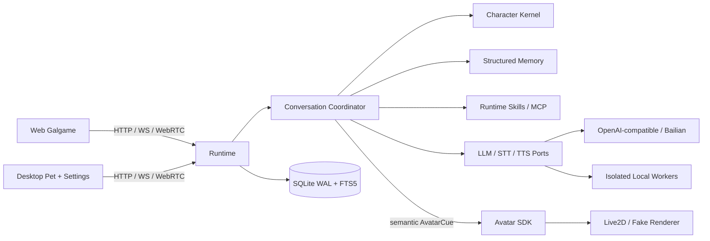

<p align="center">
  
</p>

<h1 align="center">ChatWaifu NEXT</h1>

<p align="center"><strong>想聊的时候，她一直都在。</strong></p>

<p align="center">
  
</p>

<p align="center">
  <a href="https://mubai-he.github.io/ChatWaifu-NEXT-docs/">文档</a>
  · <a href="#快速体验">快速体验</a>
  · <a href="#二次开发">二次开发</a>
  · <a href="docs/implementation-status.yaml">实现状态</a>
  · <a href="CONTRIBUTING.md">贡献指南</a>
</p>

ChatWaifu NEXT（ChatWaifuV2）想做一件很简单的事：让你喜欢的角色不只待在一段 Prompt 里。她能听你
说话、记住你提过的小事，也会随着相处改变语气、表情和动作。你可以在浏览器里像玩 Galgame 一样聊天，
也可以让她作为桌宠一直留在桌面上。

当前 Demo 从绫地宁宁主题开始，但人格、声音、模型和 Avatar 都可以替换。Web 与桌宠放在同一个项目中
维护，各自构建、各自发布，共用同一套对话、记忆和语音能力。Desktop 目前仍只生成未签名安装候选。

> **项目状态**：基础可用 Demo，仍在活跃开发。发行许可证尚未选定；宁宁 Live2D、训练音色、
> checkpoint、Cubism Core 和其他 owner-only 资产不随源码分发。公开发布或二开分发前请先阅读
> [许可与资产边界](LICENSES.md)。

## 从 ChatWaifu 走到 NEXT

最早的 [ChatWaifu](https://github.com/cjyaddone/ChatWaifu) 已经证明，聊天模型、角色语音和 Live2D 放在
一起，确实能产生很特别的陪伴感。NEXT 没有改变这个方向，只是把当年分散在脚本里的能力重新整理了一遍：
聊天可以打断，记忆可以留下，模型和声音可以替换，Web 与桌宠也不必再各做一套。

|     | 能力                     | 现在的实现                                                                                                                |
| --- | ------------------------ | ------------------------------------------------------------------------------------------------------------------------- |
| 🎙️  | **开口就能聊**           | 浏览器麦克风、Silero VAD、faster-whisper、唤醒词门控、自动结束和抢话打断                                                  |
| 🌙  | **说话时，她也会动**     | typed `AvatarCue`、动作状态机、表情/注视/口型、Live2D 与 Fake renderer 安全回退                                           |
| 🧠  | **她记得，也允许你删掉** | SQLite WAL + FTS5、结构化提取、审核、去重、冲突修正、来源、隐私和可重建语义投影                                           |
| 💗  | **相处会留下痕迹**       | Affect/Relationship reducer、关系阶段、Prompt 预算和跨 LLM 的 persona 约束                                                |
| 🔊  | **声音由你来选**         | 本地 Qwen3-TTS / GPT-SoVITS 与百炼 Qwen VC / CosyVoice 共用 TTS contract；Kokoro、macOS say、Fake 作为可配置 adapter/回退 |
| 🧩  | **想让她帮忙，也有边界** | Runtime Skills、OpenAI tool calling、MCP Host/Server、权限确认、超时、取消、审计和平台沙箱                                |
| 🖥️  | **浏览器里聊，桌面上陪** | Galgame Web 与 Tauri 桌宠独立编译，复用 Runtime、会话、语音、记忆和 Avatar SDK                                            |

## 产品形态

| 产品          | 面向用户的界面                               | 开发/构建入口                              | 产物                    |
| ------------- | -------------------------------------------- | ------------------------------------------ | ----------------------- |
| Web           | Galgame 对话、Live2D、Avatar Lab             | `make dev-web` / `make build-web`          | `apps/web/dist/web`     |
| Desktop UI    | 透明桌宠、独立设置、托盘                     | `make build-desktop-ui`                    | `apps/web/dist/desktop` |
| Desktop Host  | Tauri 窗口、sidecar、安装生命周期            | `make desktop` / `make build-desktop-host` | 原生开发 Host           |
| Windows x64   | Desktop + 冻结 Runtime + AppContainer helper | `tools\windows\build_installer_x64.ps1`    | NSIS 安装候选           |
| Local AI Pack | 隔离 Python、模型 SDK、权重、CUDA            | Windows Worker Pack builders               | 独立 `.cwpack`          |

Web 与桌宠不是同一个页面套皮。它们从 `apps/web/src/main.web.tsx` 与
`apps/web/src/main.desktop.tsx` 两个编译期入口生成不同依赖图，并由
`chatwaifu-product.json` 记录实际组成。详细发行边界见
[ADR 0026](docs/adr/0026-monorepo-product-release-profiles.md)。

## 快速体验

### 1. 先把界面跑起来（不需要模型）

需要 Python 3.12、[uv](https://docs.astral.sh/uv/)、Node.js 22/npm、Rust/cargo 和 GNU Make。
项目会在 `.local/tooling/` 准备固定 pnpm，不要求全局安装 pnpm。

```bash
git clone https://github.com/MuBai-He/ChatWaifu-NEXT.git
cd ChatWaifu-NEXT
make bootstrap
```

在第一个终端启动使用确定性轻量 TTS 的 Runtime：

```bash
CHATWAIFU_TTS__PROVIDER=fake \
CHATWAIFU_TTS__DEFAULT_PROVIDER=fake \
CHATWAIFU_TTS__WORKERS='{}' \
make dev-runtime
```

在第二个终端启动 Web，然后访问 <http://127.0.0.1:5173>：

```bash
make dev-web
```

这一模式不需要宁宁模型、参考音频、CUDA 或第三方 API Key，适合验证 UI、对话、记忆、Skills 和
Fake Avatar。默认聊天模型是明确标注的离线 Demo；真实模型在页面“模型”设置中配置。

### 2. 接上本地声音

`make demo` 会监督 faster-whisper、Qwen3-TTS、GPT-SoVITS、Runtime 与 Web，但它需要本机已有
`.local/config/tts-profiles.toml`、对应隔离环境和合法取得的模型资产。它会自动准备/缓存公开的
faster-whisper Base；**不会下载私有 Qwen/GPT-SoVITS 声音权重**。

先按[本地神经 TTS 指南](docs/operations/neural-tts.md)准备本地 profile，再运行：

```bash
make demo
# 不自动打开浏览器：make demo DEMO_ARGS=--no-open
```

桌宠开发版在本地语音环境准备完成后运行：

```bash
make desktop
```

更完整的 macOS、Windows、Live2D、模型和故障排查步骤放在
[ChatWaifu NEXT 文档站](https://mubai-he.github.io/ChatWaifu-NEXT-docs/guide/getting-started)，README 只保留
可验证的最短入口。

## 配置模型、语音与角色

模型配置不再依赖 `.env`。在 Web 或桌宠设置中可以分别配置：

- `chat`：主对话与 OpenAI-compatible tool calling；
- `memory_extraction`：记忆候选提取；
- `memory_summary`：长期对话压缩；
- `embedding`：可重建语义索引。

API Key 是只写字段：浏览器不持久化也不会拿回明文，Runtime 保存到 Git 忽略的本地权限文件。TTS
同样通过统一设置面板选择本地 Worker 或百炼 Provider。Qwen MLX、GPT-SoVITS 和百炼适配器可以使用
原生 PCM 流；Windows Qwen3-TTS Torch/CUDA pack 目前由官方 wrapper 先生成完整波形，因此诚实报告
`native_streaming=false`。

默认角色包位于 `characters/default/`。它只提交 persona、关系策略、语义动作能力和逻辑 voice
profile；Live2D 模型、参考音频与 checkpoint 继续保留在本机。当前多角色 Runtime 可以发现角色包，
但 Live2D 前端仍使用固定 manifest，完整的多角色资产注册/切换尚未完成。

## 系统架构



主要技术栈：Python 3.12 + FastAPI/Pydantic/Pipecat/SQLite、TypeScript + React/Vite、Rust + Tauri 2。
仓库采用 modular monolith，在保持一次本地运行体验的同时，把实时媒体、会话、模型、角色、记忆、
Skills、Avatar、前端和持久化分成可测试边界。

| 路径                                | 所有权                                                                |
| ----------------------------------- | --------------------------------------------------------------------- |
| `apps/web/`                         | Web/Desktop UI、设置和 typed Runtime clients                          |
| `apps/desktop/`                     | Tauri Host、窗口/托盘、Runtime sidecar 和安装器                       |
| `services/runtime/`                 | 会话、实时链路、Character Kernel、记忆、Skills/MCP、Provider adapters |
| `packages/protocol-python/`         | 跨进程/跨语言协议的唯一源                                             |
| `packages/protocol-typescript/`     | 生成类型与手写信任边界 parser                                         |
| `packages/avatar-sdk/`              | AvatarCue 调度、动作状态机、口型与 renderer 接口                      |
| `packages/model-worker-sdk-python/` | Worker DTO、PCM v2 与 `.cwpack` 合约                                  |
| `workers/`                          | faster-whisper、Qwen/GPT-SoVITS、Kokoro 等隔离模型进程                |
| `characters/`                       | 可审计角色包；不存放私有模型资产                                      |
| `skills/`                           | 产品 Runtime Skills；与 `.agents/skills/` 开发指南严格分开            |

架构决策以 [ADR](docs/adr/) 为准；当前完成度和仍未验证的部分以
[`docs/implementation-status.yaml`](docs/implementation-status.yaml) 为准。

## 二次开发

扩展链路应保持为：

```text
Web / Desktop UI
  → typed Runtime API + boundary parser
  → application service
  → domain port / provider-neutral contract
  → adapter / repository / isolated Worker
```

| 要扩展的内容 | 从这里开始                                                                                               | 关键规则                                                           |
| ------------ | -------------------------------------------------------------------------------------------------------- | ------------------------------------------------------------------ |
| 角色         | `characters/<id>/`、`services/runtime/src/chatwaifu_runtime/characters/service.py`                       | 六文件包严格校验；真实资产、路径、密钥不进角色包                   |
| LLM          | `providers/contracts.py`、`providers/model_config.py`                                                    | OpenAI-compatible 通常零代码；新协议封装在 adapter                 |
| 云端 TTS     | `providers/tts_registry.py`                                                                              | 注册一次生成通用配置/API/UI，禁止复制 Provider 专属设置页          |
| 本地 TTS/STT | `packages/model-worker-sdk-python/`、`workers/`                                                          | 重型 SDK 不进入 Runtime；能力、取消、离线和真实音频 smoke 必须通过 |
| Avatar       | Protocol `AvatarCue`、`services/runtime/src/chatwaifu_runtime/avatar/planner.py`、`packages/avatar-sdk/` | Agent 只发语义 cue；Live2D 参数/文件名只属于 renderer              |
| Memory       | `memory/` ports/policy/retrieval、`persistence/` adapter                                                 | 模型只能提候选；写入必须经过策略、去重、冲突、来源与隐私           |
| Skill/MCP    | `skills/`、`runtime_skills/`                                                                             | schema、权限、副作用、确认、超时、取消、审计、沙箱缺一不可         |
| 设置         | `desktopSettingsRegistry.tsx`                                                                            | 新 section 通过 registry/typed context 注册，不修改页面大 switch   |
| 协议         | `packages/protocol-python/`                                                                              | Python 是唯一源，生成 Schema/TS，边界做 Zod parse                  |

几个不能破坏的约束：

1. 前端不直接调用 LLM、STT、TTS 或 MCP 供应商。
2. 每个实时 generation 都携带 `session_id`、`turn_id`、`generation_id`，只有当前 generation 可播放。
3. 新流式实现必须覆盖取消、迟到/乱序 chunk、有界缓冲、重连和 teardown。
4. Memory 与 Runtime Skills 依赖 repository port，不从业务服务直接写 SQLite。
5. Provider SDK 对象留在 adapter；模型权重和 CUDA 留在 Worker/Pack。
6. 不手改 `schemas/domain/v1/` 或生成的 TypeScript；协议变更运行 `make generate-protocol` 和
   `make check-generated`。

逐类扩展步骤、文件清单、测试门和二开发行检查表见
[二次开发文档](https://mubai-he.github.io/ChatWaifu-NEXT-docs/guide/customization) 与
[Contributing](CONTRIBUTING.md)。现阶段 TTS 已有统一 Provider registry；LLM 的 OpenAI-compatible
入口稳定，但非兼容协议和 STT Provider 尚未达到同样的单点自动注册程度。

## Windows 与本地模型包

基础 Windows 安装包刻意不塞入 CUDA、PyTorch、模型权重和私有声音。它包含桌宠前端、Tauri x64
Host、冻结 Runtime、AppContainer helper 与必要资源；Qwen3-TTS 和 faster-whisper 通过独立、版本化、
可校验的 `.cwpack` 安装。这避免每次更新 UI 都重新分发数 GB 模型，也允许 Runtime 在 Worker 不可用时
安全回退。

```powershell
.\tools\windows\bootstrap_x64.ps1
.\tools\windows\build_installer_x64.ps1
```

完整的安装、pack 构建和验收命令见 [Windows 安装指南](docs/operations/windows-local-ai-worker-packs.md)。
目前 owner-only 未签名 NSIS 候选已在 Windows 11 ARM 的 x64 模拟环境通过基础安装 smoke；原生
x64/CUDA 笔记本上的 pack 构建/安装态推理、干净账户完整 UI/语音流程、正常退出、升级重装、安装态
MCP/AppContainer、许可证审查和签名仍待完成，因此不能标记为公开发行版。

## 开发质量门

```bash
make format-check       # Python / TypeScript / Rust 格式
make lint               # Ruff / ESLint / Clippy
make typecheck          # Pyright / tsc / cargo check
make test               # Python / TypeScript / Rust tests
make test-contract      # Python ↔ JSON Schema ↔ TypeScript
make test-e2e           # Web 与 Desktop profile 浏览器验收
make check-generated    # 受控协议产物无漂移
make build-web
make build-desktop-ui
```

实时、记忆、Skill、协议或安装器改动还需要运行对应专项测试和目标平台 smoke。构建成功不等于产品验收；
请在真实浏览器、Tauri 窗口或目标 Windows/CUDA 机器上验证用户可见路径。

## 当前边界

- 已实现 Scheme A 结构化记忆与 SQLite 可重建 Scheme B 语义投影；外部向量数据库和 Scheme C 时序图未实现。
- 本地/云 TTS 有统一 contract，但 Windows Qwen Torch 还不是真正首 chunk 流式。
- 多标签页共享一个 session 时，播放事实尚未按浏览器 client ID 隔离。
- Playback ACK 目前按句段，不是逐词边界；长时间多轮语音压力测试仍待完成。
- 通用 RTVI、公网 TURN 和多机恢复尚未完成。
- Windows 基础安装 smoke 已通过；原生 x64/CUDA、完整安装态产品流程、签名和可分发资产仍是 release gate。

## 安全、隐私与许可

- 不提交 API Key、token、用户记忆、数据库、参考音频、模型权重、私有 Live2D 或 OS keychain 导出。
- 密钥由 Runtime 只写保存，不进入浏览器 local storage；本地模型 Worker 使用动态 loopback token。
- 不可信插件必须通过真实 OS 沙箱；无法强制执行时 fail closed，不静默退化成“软隔离”。
- 本项目是非官方同人技术 Demo，与 YUZUSOFT/JUNOS、Live2D Inc. 或声优本人无隶属关系。
- 仓库发行许可证尚未选定。在 [LICENSES.md](LICENSES.md) 更新前，不要公开再分发仓库或 owner-only 资产。

安全问题请按 [SECURITY.md](SECURITY.md) 通过私有渠道报告。

## 文档与项目沿革

- [安装与使用 Wiki](https://mubai-he.github.io/ChatWaifu-NEXT-docs/)
- [架构方案](CHATWAIFU_NEXT_ARCHITECTURE.md)
- [实现计划](CHATWAIFU_NEXT_IMPLEMENTATION_PLAN.md)
- [交接与不变量](CODEX_HANDOFF.md)
- [实现状态](docs/implementation-status.yaml)
- [Web/Desktop 发行模型](docs/architecture/product-release-profiles.md)
- [Windows Worker Packs](docs/operations/windows-local-ai-worker-packs.md)

文档规范源保留在本 private monorepo；`make publish-docs` 只把经过路径、密钥和私有资产审计的静态产物
发布到 public Pages 镜像，不复制产品源码或本地资产。

感谢上一代 [cjyaddone/ChatWaifu](https://github.com/cjyaddone/ChatWaifu) 对语音角色交互方向的早期探索。
NEXT 是一次架构重写，不与上一代配置、模型目录或启动脚本保持兼容。
