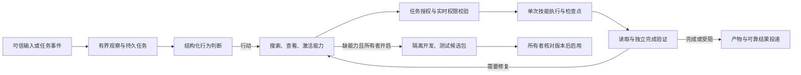

# 宁宁自主 Agent：实现与验收

本次代码位于 `mubai/ningning-autonomous-agent`，基线 `7f9bab6e`。桌宠、QQ 继续共用主 Runtime；没有引入外部 Agent 服务，没有修改生产配置或发送真实 QQ 消息。

## 已接通的链路



| 阶段     | 实现入口                                             | 当前交付                                                                                           |
| -------- | ---------------------------------------------------- | -------------------------------------------------------------------------------------------------- |
| 能力发现 | `agent/capabilities.py`、`skills/builtin/qq-scene/`  | 三个常驻发现工具、分页兜底、动态加载、明确状态；新注册技能无需修改意图路由                         |
| 主动决策 | `agent/behavior.py`、`external_channels/autonomy.py` | 群 off/shadow/member、批次更新、持久预算与安静状态；桌宠 legacy/shadow/model；任务唤醒复用判断服务 |
| 持续任务 | `agent/tasks.py`、`api/agent_routes.py`              | CAS 授权/暂停/继续/取消、持久事件、重启核实、失败修复、真实证据验证、结果通知                      |
| 文件交付 | `agent/workspace.py`、`external_channels/files.py`   | 受限工作区、Word/PPT 工人进程、渲染校验、不可变产物、预览下载、QQ 文件传输与回执日志               |
| 候选开发 | `agent/development.py`                               | 真实隔离进程、参数契约与至少三个测试、最多三次修复、候选包下载、按哈希批准启用与插件关闭           |

## 启用与权限

1. 以源码 Runtime 运行 `uv sync` 和 `pnpm install`。文档生成需要 `node`、PptxGenJS 和 `soffice` 在运行主机可用；Linux 需要中文字体。缺依赖时能力显示“未配置”。冻结打包的 Runtime 暂不运行 Python 文档/材料工人，会显示明确限制。
2. 网页 `/settings/agent`，桌面设置“能力与任务”，可搜索实际能力、创建目标并选择本任务允许的技能、工作区子目录、Calendar ID 和写入权限。文件目录是 Runtime 主机的数据工作区，不等于用户电脑的任意路径。
3. 渠道设置开启 QQ 所有者 Agent 权限后，绑定的所有者私聊才可请求这些技能。群成员不继承所有者权限。群设置先用“影子模式”观察，再逐群切到“常驻群友”。旧群迁移默认 off；桌宠默认 legacy。
4. 群任务只能使用当前场景的 QQ 查询、场景工作区、文档、当前目标文件交付和任务技能。权限绑定账号、路由/成员/受众和版本，执行与发送前再核对。群接收目标不由模型填写。
5. 每个目标默认 100 次工具、1800 秒活动时间；等待确认和定时唤醒不消耗活动时间。全 Runtime 同时运行最多四个任务，排队时间不计入活动预算。明确任务授权减少逐步确认。更新授权会暂停任务，核对后“继续”；结果未知必须先提交所有者核实证据，仍需要回读验证。
6. 开发默认关闭。开启后每天最多一个候选任务；批准前不进入可执行技能目录。第一版候选只支持隔离的纯 JSON 转换 MCP 技能。核心改动、部署和有网络/正式数据依赖的功能仍需独立适配发布。

安静时段继承群配置。每群默认三秒合并、最短十秒判断、每小时 240 次判断/20 次自主发言、最短三十秒发言间隔。任务产物与结果通知也占实际自主发言预算；关闭模式立即取消尚未发送的自主投递。任务、已生成文件、旧回执保留。没有新消息、活动变化或到期事件时不重复调用模型。

桌宠空闲主动入口第一版执行等待、回应和澄清；持续任务由明确交办或任务事件进入，不会根据一次空闲判断自动扩大所有者授权。群未提及任务与能力缺口会留下结构化来源和理由。记忆仅保存模型选择的原始稳定信息，继续使用已有纠正、遗忘及隐私流程。

## QQ 目录与资料

目录来自官方 [NapCat 4.18.33 OpenAPI](https://github.com/NapNeko/NapCatDocs/blob/main/src/api/4.18.33/openapi.json)，保存源 SHA-256。178 个未废弃官方接口进入可搜索目录；七个场景查询接口经作用域审核，再加受控资料读取 `read_file`。其余接口显示“需要适配”，不能用万能 RPC 绕过权限。通用场景适配器可以复用，新增普通接口仍须补充范围声明和契约测试。复杂上传使用专用受限流式传输。

查询结果中的消息、目录、文件由 Runtime 发放短期不透明引用。模型不能提供任意群 ID、任意文件 URL 或发送目标。连接账号和 NapCat 版本不匹配会拒绝执行。资料下载只走经 DNS 检查的公网 HTTPS、无重定向/代理环境，限制体积与时间，并在下载前后重新核对范围。支持 TXT/MD/CSV/JSON/PDF/DOCX/PPTX 文本提取；扫描 PDF、图片/OCR 和其他二进制格式需要进一步适配。

七个已审核查询接口同时支持 4.18.28。导入器对官方两个版本的请求、响应契约逐一比对一致后，记录兼容版本及源 SHA-256；Runtime 只接受目录中有审核证据的精确版本。新增其他可执行接口须重新检查这份兼容声明，不能扩大到未审核动作。

## 文件与投递事实

每个文件有作用域、task_id、字节数和 SHA-256；访问时重新验证文件大小、内容和路径。Word/PPT 先检查 ZIP 结构，再转 PDF 并核对期望内容，渲染不通过会返回可修复失败。文档与 PDF 分别保存不可变产物，前端使用鉴权下载；PDF 预览按需加载 PDF.js 独立 Worker，在页面内渲染，不依赖原生浏览器 PDF 插件。预览支持分页、关闭与焦点恢复；最多 200 页，单页最多 1200 万像素、任一边最多 4000 像素，关闭时销毁 Worker 并取消渲染。

QQ 上传限制 32 MiB，校验分块完成结果、目标账号、文件路径/大小/哈希和实时授权。提交前持久记录未知效果；回执丢失不会盲目重发。后台文本结果也使用相同投递系统和新有效 generation。以下事实分别保存：生成/结构/渲染完成、平台接受、平台回执确认、用户收到并可打开。当前自动检查证明前三种链路的隔离测试；手机实际收件和打开尚未验收。

## 验证与复现

```bash
uv run pytest -q
uv run pyright
uv run python tools/check_architecture_boundaries.py
pnpm protocol:generate
pnpm --filter @chatwaifu/protocol test
pnpm --filter @chatwaifu/web test
pnpm --filter @chatwaifu/web typecheck
pnpm --filter @chatwaifu/web lint
pnpm build:web
pnpm build:desktop-ui
uv run python tools/verify_product_artifacts.py --product web
uv run python tools/verify_product_artifacts.py --product desktop
```

真实模型评测读取指定源项目当前 chat 配置和凭据引用，仅只读原数据库。测试 Runtime/工作区独立；QQ/Calendar 是隔离传输 fixture。每条记录包含工具调用、原生用量、延迟、任务状态及作用域。脚本拒绝覆盖旧证据，门槛未过退出码为 2。

```bash
uv run python tools/agent/evaluate_autonomy.py --source-root /path/to/configured/CW2 \
  --output /tmp/new-agent-evidence.jsonl --repeats 3 --concurrency 3
```

浏览器验收使用独立回环端口和 `/tmp` 数据目录，固定 fixture token 只在这个一次性服务器有效：

```bash
uv run python tools/agent/browser_fixture_runtime.py --root /tmp/cw-agent-browser --port 8778
VITE_RUNTIME_URL=http://127.0.0.1:8778 VITE_RUNTIME_TOKEN=disposable-agent-browser-fixture \
  CHATWAIFU_E2E_AGENT=1 pnpm --filter @chatwaifu/web exec playwright test --config playwright.agent.config.ts
```

历史模型试测日志与截图保留在原工作树 `docs/research/ningning-agent-2026-10-07/`，未经逐项隐私审查，不随本 PR 发布。确定性验收以本 PR 的独立检查记录与 CI 为准。源码测试、真实模型、真实浏览器、生产部署及真实账号/手机验收各自记录，不相互替代。
