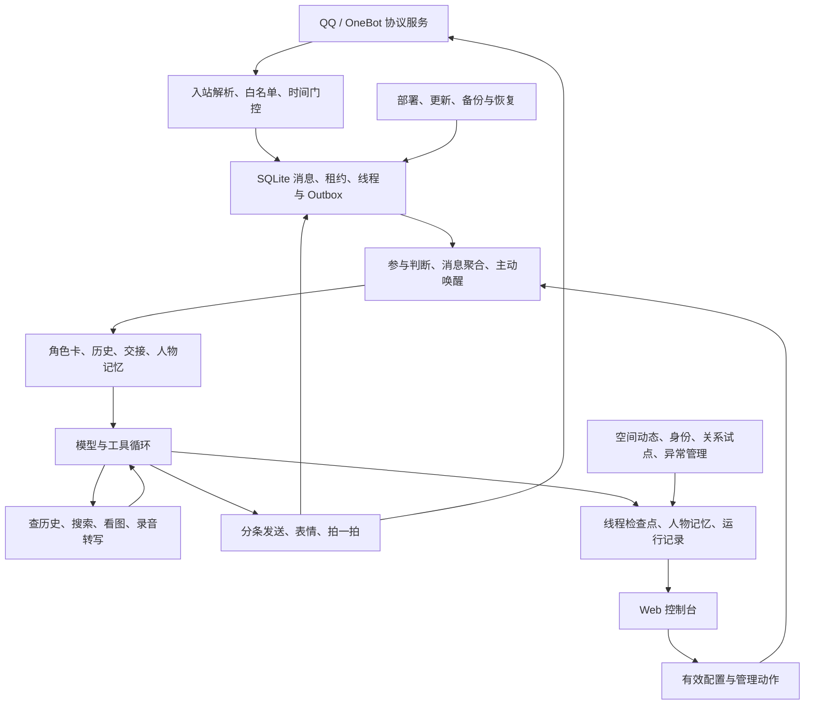

# QQ Agent Plus 项目研究与 CW2 借鉴清单

记录日期：2026-09-29。

- 研究对象：[sakurawwwxh/qq-agent-plus](https://github.com/sakurawwwxh/qq-agent-plus)。
- 固定源码版本：`cd5b64abafb80985b930bb1062d547e2c3ecaf89`，`package.json` 版本 `0.7.4`。
- CW2 对照版本：`285262a`。结论针对该本地 checkout，不代表其他工作树或已部署版本。
- 本文保存前两轮结论，并补充全仓模块级走读、验证记录和借鉴优先级。
- 当前状态：固定快照的全仓模块级复核已完成。大型文件采用关键路径抽读；没有声称逐行形式审计或真实 QQ / Linux 部署验收。
- 配套证据：[265 个受控文件清单](qq-agent-plus-evidence/inventory.tsv)、[验证记录与覆盖范围](qq-agent-plus-evidence/validation.md)。
- 后续实施：[CW2 可执行借鉴方案](cw2-qq-agent-plus-adoption-plan.md)。该方案重新核对 CW2 现有能力，明确复用、增量、依赖和验收；尚未实施。
- 项目归属：本文第 3、8 节及 evidence 中的测试结果均属于 QQ Agent Plus，不是 CW2 的测试失败清单。

## 1. 已记录的核心判断

该项目的突出价值，是把人格、参与时机、工具动作、上下文续接和发送恢复放进同一个运行流程。角色表现可以通过具体行为约束持续强化，出现问题后也能从运行记录追查原因。

这不是已经通过真实模型对照实验的因果结论。源码能证明机制存在；用户观察到的人格表现，仍受模型、参数、群聊文化和实例配置影响。

### 1.1 角色与交互

角色卡把抽象性格转为场景规则：被反驳时认输、对方认真时收住、无人接梗时停止、承认 AI 时保留角色口吻。正反例明确了可观察的表达目标。短句与分条动作减少了通用助手式铺垫、解释和总结进入回复的机会。

运行机制提供了进一步支持：

- 默认 8–12 秒有界消息聚合，聚合等待最长 20 秒；这不是完整回复延迟上限。
- `send_message` 支持数组，由模型决定表达单元，发送队列安排间隔；普通 assistant 正文不会直接发往 QQ。
- 提示词明确角色设定高于平台默认风格；换卡后提醒模型不要模仿旧历史口癖。
- 交接保存事实、未决问题和实际发言，并提醒上一话题的戒心与态度不要延续到新话题。
- 表情选择兼顾常用项与未使用/较久未使用项，减少同一批表情垄断上下文。

主要证据：[角色卡][Q-role]、[提示词组装][Q-prompt]、[工具实现][Q-tools]、[表情选择][Q-stickers]。

需要保留的批判性判断：

- “每次开口都带损味”与认真求助时收住存在张力，应明确场景优先级。
- 对明确要求停止吐槽的人回复“收敛三分钟”，可能仍在延续对方拒绝的互动。
- “翻车记忆”需要共同认可、相关性和真实来源，示例中的“昨天 0–8”不能变成虚构经历。
- 平台收尾提示要求补“自己的半句”，可能与一句到位、不机械追问冲突。
- `legacy` 与 `grounded` 策略的区分值得借鉴；CW2 兼具实际任务能力，应保留认真求助时的可靠性。
- 关系感知试点当前强制 `shadowMode`，不能把主模型人格表现归因于该试点的评分。

### 1.2 架构与恢复

主链路是模块化 Node.js 单体，外接独立 OneBot 协议服务：

```text
OneBot 入站 → SQLite 去重与待处理消息 → 有界聚合/触发
→ Agent 执行 + 可选持续线程 → 当前聊天绑定工具
→ Outbox 预写与发送队列 → OneBot 出站
```

三种身份分别管理不同生命周期：`chatKey` 是群/私聊；`sessionId` 是一次执行及审计范围；`threadId` 是跨执行的持续对话。线程能够持久化续接，空闲期间不需要保持模型请求连接。

关键优势：

1. 数据库按聊天限制单个有效执行租约；运行期间新消息保持待处理状态。
2. 主聊天发送预先写入 Outbox，区分确认成功、确认失败和不确定结果。不确定时挂起核对，降低盲目重放导致的重复回复。
3. 生命周期模式将消息确认、线程状态、检查点和模型对话增量放在一个 SQLite 事务中，避免半提交。
4. 模型、系统提示词和工具定义参与上下文前缀摘要；变化时关闭旧线程。上下文增长、线程期限和单次运行预算分别管理。
5. 消息发送目标由运行时提供，不暴露任意目标群号参数；白名单、观察模式、暂停与时间门控在代码中执行。
6. 运行记录连接触发原因、实际模型输入、工具调用、用量与实际发送，支持诊断角色漂移、沉默与交付失败。
7. 部署提供快照、健康检查和恢复旧版本路径。

主要证据：[架构说明][Q-architecture]、[会话模式][Q-modes]、[存储][Q-store]、[编排器][Q-orchestrator]、[发送队列][Q-sender]、[运行记录][Q-sessions]。

不能扩大解释的保证：

- SQLite 事务不覆盖远端 QQ、所有 JSON 文件和其他特性数据库；不能宣称端到端 exactly-once。
- 工具的聊天范围约束不是操作系统沙箱，也不等于完整的用户级权限模型。
- 生命周期内可以保留供应商 `reasoning_content`；不能说所有推理字段都被立即丢弃。
- 稳定前缀有利于供应商缓存，但不保证命中；运行预算含估算，第一轮有特殊处理，不是严格费用上限。
- 编排器约 2,500 行、控制台入口约 4,100 行，运行模型值得借鉴，源码边界仍有整理空间。

## 2. CW2 初步借鉴清单

以下保留初步研究判断；具体实施以 [CW2 可执行方案](cw2-qq-agent-plus-adoption-plan.md) 为准。尤其是表情学习、交付使用记录、重复规避及记忆纠错，CW2 已有基础，后续不再作为从零建设任务。

| 优先级 | 借鉴方向               | CW2 已有基础                                    | 后续最小完整切片                                            |
| ------ | ---------------------- | ----------------------------------------------- | ----------------------------------------------------------- |
| 高     | 场景化角色行为卡       | 宁宁 persona、Character Kernel、短消息约束      | 场景规则、正反例、冲突优先级、多轮对照评估                  |
| 高     | 单次互动完整诊断视图   | 事件、generation、记忆来源、交付状态            | 串联触发、角色版本、记忆选取、工具、实际交付；保留隐私控制  |
| 高     | 明确的持续对话状态     | 会话、轮次和持久化仓储                          | 定义续接、等待、结束与恢复语义，再决定是否新增 contract/ADR |
| 高     | 配置变化后的上下文处置 | PromptCompiler、角色与模型配置                  | 角色/工具/模型版本变化的影响规则与回归测试                  |
| 中     | 参与策略和生成分开     | 主动行为与外部渠道入口                          | 对群聊、环境事件、主动行为定义参与决定及可观测理由          |
| 按渠道 | 聚合、分条与节奏       | 分条交付、租约、稳定 provider client ID、调度器 | 在现有交付基础上调整；语音保留 generation 取消语义          |

CW2 候选改进点：默认角色卡的场景反应规定较少；`_plan_response` 接收角色资料但当前不使用；身份问题的诚实说明可以保留，同时避免日常问候都变成产品介绍。上述为源码候选原因，不是已完成的效果对照。

## 3. 前两轮验证记录

| 范围           | 命令                                                                     | 结果                      | 证明范围                                         |
| -------------- | ------------------------------------------------------------------------ | ------------------------- | ------------------------------------------------ |
| 角色卡与模板   | `node --test test/personas.test.mjs test/persona-template-sync.test.mjs` | Astra 独立执行，19 passed | 加载、同步、工具名与模板约束                     |
| 存储与运行标识 | `node --test test/store.test.mjs test/session-persona-label.test.mjs`    | Astra 独立执行，20 passed | 去重、租约、重开恢复、生命周期事务回滚、角色标签 |

这些结果不等于真实模型多轮人格评估、真实 QQ 网络故障测试或 Linux 部署验收。Gemini 提供了只读调查，正文采纳项由 Astra 核对关键源码。

## 4. 全仓复核

### 4.1 整体定位

它已经形成一个面向 QQ 群聊的、可长期运行和维护的角色产品：除了回复消息，还管理表情资产、人物印象、互动时机、空间动态、异常处理和更新部署。

核心取舍很清楚：单机、单 Node.js 进程、少量依赖、SQLite 与文件持久化，外接 OneBot 协议服务。它适合一个管理员经营一个角色实例。源码没有提供多租户水平扩展或多副本一致性的完整基础，不应仅凭 SQLite 租约就把它理解为分布式 Agent 平台。

与 CW2 的目标也有区别：它主要优化异步文字群聊；语音能力集中在已有录音的转写，不能替代 CW2 的实时音频、打断、播放状态与 Live2D 语义呈现。8–12 秒聚合可能适合群聊，却不适合直接移入实时语音链路。



图表示主要职责和依赖，不代表所有旁路副作用都经过主聊天 Outbox，也不表示图中节点是独立服务。

### 4.2 覆盖清单

| 模块                                    | 文件数 | 复核重点                                               | 深度与验证边界                                                 |
| --------------------------------------- | -----: | ------------------------------------------------------ | -------------------------------------------------------------- |
| 根目录、`.github/`、`docs/`、`scripts/` |     57 | 依赖、协议定位、部署、更新、CI、发布、许可             | 清点全部文件；关键脚本与工作流走读，文档按主题交叉核对         |
| `src/core/`                             |     16 | 编排、配置、租约、线程、运行记录、门控、Provider 管理  | 主链路细读；辅助逻辑按调用路径核对；运行本地测试               |
| `src/llm/`                              |     19 | 提示组装、模型兼容、搜索、安全抓取、视觉探测、7 类 ASR | 所有子域纳入调查；未连接真实模型或云端 ASR                     |
| `src/tools/`                            |      5 | 工具目录、执行上下文、内联工具解析、媒体转换           | 定义与执行链路核对；媒体真转换受本机 ffmpeg 缺失限制           |
| `src/onebot/`                           |      6 | 消息段、发送、合并转发、表情管理、空间 Feed            | 协议和失败路径走读；没有登录真实 QQ                            |
| `src/memory/`                           |      5 | 全局人物印象、会话交接、整理、备份、身份集成           | 读写与提示注入边界细读；相关单测运行                           |
| `src/identity/`                         |      4 | 身份聚合、入站好友审批、退役主动加好友链路             | 对照有效配置，而非只看 `enabled` 字面值                        |
| `src/features/`                         |      3 | 每日动态、时间窗口抽签、空间互动                       | 调度、去重、失败退避与外部写状态走读                           |
| `src/pilots/`                           |      8 | 关系影子评估、异常、黑话退役、并发工具、多模态续接     | 核对主流程实际接入位置与默认开关                               |
| `src/console/`、`ui/`                   |     16 | 配置、会话诊断、资产、成本、控制入口                   | 后端关键路由与前端关键渲染抽读；VM 测试及真实浏览器空实例检查  |
| `src/pricing/`                          |      4 | 官方参考价、渠道价、远程价目、探测缓存                 | 优先级、失效、删除墓碑与 UI 口径走读；未验证实时价格           |
| `src/` 下六个独立入口文件               |      6 | 服务、人设、运维、自动更新、更新网络与通知             | 入口装配、退出和更新调用链核对                                 |
| `roles/`                                |      5 | 角色卡、行为策略与工具一致性                           | 卡片对照阅读、模板测试；未做五角色真实模型比较                 |
| `test/`                                 |    111 | 单测、本地回归、渲染、滚动、用量、遗留工具             | 全部清点；执行当前 CI 对应的本地检查，不能将文件数当测试通过数 |

总计 **265 个受控文件**。清单的 SHA-256 用于固定分析对象，不代表每个文件逐行审查。`ui/app.js` 约 12,200 行，属于关键路径抽读；运行测试也不意味着覆盖其中全部分支。

## 5. 全项目中最值得借鉴的八个设计

### 5.1 “是否参与”有独立的运行逻辑

它先通过私聊、@、关键词、随机参与、时间窗口等条件决定是否开启一次处理，再把触发原因交给角色。模型可以选择安静结束；正文也不会自动等同于发消息。结果是“知道群里发生了什么”和“必须开口”被分开了。

这直接影响角色感：一个总是响应、总是补充建议的角色，很难像群友。值得迁移的是参与决定及其理由，不是固定的概率和延迟。CW2 应按私聊、群聊、环境事件和主动提醒分别定义规则。[参与判断与唤醒][Q-orchestrator]

### 5.2 记忆按用途分层，人物有稳定标识

项目中至少有四类不同状态：原始消息档案、当前线程与检查点、会话交接、按 QQ 号保存的全局人物印象。身份库再承载昵称、群成员关系与互动统计。换昵称后仍能认出同一个人，交接则回答“刚才聊到哪一步”。

人物印象整理前会备份，降低模型错误归纳覆盖旧资料后的恢复成本。这个想法可以迁入 CW2 的记忆修订历史，但不应把这里的全局共享策略一并复制；可见范围、事实来源与允许公开转述的范围仍应由代码过滤。[人物记忆][Q-person-memory]、[交接与注入][Q-memory]、[整理备份][Q-memory-backup]

### 5.3 人格能落实为动作，而不只存在于文风中

短句、分条、表情、引用、拍一拍、潜水、稍后再说，都有对应工具或调度机制。模型选择何种表达，运行时负责执行和记录结果。角色因而可以通过“怎么参与”表现自己。

这是人格保持的重要架构支撑。CW2 可以统一规划文本气泡、表情和语义 AvatarCue，但具体发送、音频播放与 Live2D 参数应继续由各自适配器负责。不能把工具调用本身当成用户已经看到结果。[工具实现][Q-tools]、[发送队列][Q-sender]

### 5.4 表情是一类持续维护的资产

表情链路包括发现、视觉判断、收藏、备注、检索、选取、使用统计、URL 刷新和本地保存。已落盘图片可以避免完全依赖会过期的 QQ CDN 链接；无效资源在发送前尽量被发现。

这一点比简单给角色配几个 emoji 更值得借鉴：表情承载共同语境，适用场景和实际使用反馈都需要留存。不过自动筛选仍有模型成本，本地资产也需要空间与删除策略。[表情库][Q-stickers]、[资产管理][Q-sticker-manager]

### 5.5 能力适配不仅处理请求格式，也处理失败与成本

模型层适配不同渠道的思考参数、工具选择冲突、重试和兜底；搜索、看图、ASR 按能力配置进入工具集合。媒体链路将大图降采样、GIF/视频抽帧，QQ SILK 录音经解码后再交给转写适配器。

值得借鉴的是能力描述和降级边界：不支持的能力不应只在执行时突然报错。取消、下载限额、超时与临时文件清理也属于适配器责任。CW2 已有 Provider/Runtime Skill 边界，应完善这些契约，而非将 QQ 专有格式塞入 Agent 核心。

代码中的网页抓取会校验地址、固定连接到已验证 IP、重新验证重定向并限制响应大小；二进制下载存在显式允许私有图床的配置例外。这是有用的机制，但本次没有做完整安全审计，不能称其“消除了全部 SSRF 风险”。[模型调用][Q-llm]、[Provider 预设][Q-presets]、[媒体转换][Q-media]、[ASR 分发][Q-asr]、[安全抓取][Q-fetch]

### 5.6 外部副作用的不确定性被显式保留下来

聊天 Outbox 和每日动态都意识到“请求超时”不能直接解释为“肯定没发出去”。例如动态发布存在 `publish-unknown`，需要核对后才能恢复相应发布流程。空间互动还有失败退避、活动时间与每轮动作数量限制。

这让人格的长期运行建立在可靠的行动记录上：少发一条可以解释，重复刷屏则很容易破坏体验。CW2 已有 durable multipart delivery，优先把这种结果分类接入既有仓储、诊断和恢复操作，避免重新建立一套平行队列。[发送队列][Q-sender]、[每日动态][Q-moments]、[空间互动][Q-qzone]

### 5.7 控制台覆盖的是完整运作过程

除了配置页面，控制台展示会话执行、人物记忆、交接、资产、成本、异常和服务状态；人设切换还提供清理旧交接与线程的入口，直接回应“新卡仍沿用旧口癖”的问题。

这让调试可以区分：角色卡不合适、历史污染、没有命中参与条件、工具失败、发送结果不确定。CW2 最值得补的是一条互动的关联诊断视图，而不是再增加一组互不相连的状态面板。

本次真实浏览器检查确认设置、人设、会话、会话记忆、观测、用量、控制页在隔离空实例中可打开，浏览器采集日志没有 error/warn。空实例没有真实运行数据，因此未验收有内容的会话详情、聊天效果或管理动作。[控制台][Q-console]、[UI][Q-ui]

### 5.8 维护和退出路径被当成产品能力

部署区分代码与数据目录，使用 Linux 用户级 systemd；自动更新有独立预检目录、Git 与 API 下载路径、测试门槛与回滚机制。配置脱敏会删除秘密字段并返回存在性标记，避免客户端把脱敏空串当真实配置写回。渠道价格删除也有持久化墓碑，阻止后台探测复活已删除项。

这些设计解决的是长期使用中的“为什么升级后坏了”“为什么保存设置把 Key 清了”“为什么删掉又回来”。CW2 同样值得建设，但部署回滚不等于全数据库回滚，健康接口通过也不等于 QQ 登录和消息链路已经恢复。[部署][Q-deploy]、[更新器][Q-update]、[配置脱敏][Q-console]、[渠道价格][Q-channel-price]

## 6. 必须区分的功能状态

以下针对固定版本的默认值与运行时强制策略，不是用户实际部署实例的配置。

| 能力                             | 真实状态                                    | 解释                                                                 |
| -------------------------------- | ------------------------------------------- | -------------------------------------------------------------------- |
| 新实例聊天运行                   | 默认 `observe`                              | 需要实际配置与运行模式允许，不能把仓库可启动等同于会发消息           |
| 会话模式                         | 默认 `legacy`；另有 `threaded`、`lifecycle` | 不能说“所有运行都无状态”，也不能把 lifecycle 的保证套到默认实例      |
| 统一身份、入站好友请求、异常采集 | 运行时强制启用                              | `config.js` 和 stable policy 收敛旧配置；通知等动作仍有额外条件      |
| 主动加好友提议与派发             | 已退役，返回 false                          | 旧定义、文档与协议实现仍可能存在，不能当作有效能力                   |
| 自动黑话研究                     | 已退役                                      | 手工资产管理与自动研究不是同一件事                                   |
| 关系评分                         | 默认关闭；开启仍强制 shadow                 | 可用于后台观测，当前不能据此解释主聊天的人格效果                     |
| 冷场主动发言                     | 默认关闭                                    | 独立于后两种唤醒机制                                                 |
| 发言后补话、自行安排唤醒         | 配置默认开启                                | 仍受触发、时间、暂停、上下文等条件限制                               |
| 群聊自主节奏 pacing              | 默认关闭                                    | 不是普通 8–12 秒消息聚合；私聊另有即时处理规则                       |
| 每日动态、空间互动               | 默认关闭                                    | 是有真实外部写入的独立特性                                           |
| ASR                              | 默认关闭                                    | 有多个适配器不代表已经配置可用；腾讯、讯飞源码也注明缺少真实凭据联调 |
| 只读工具并发、多模态线程续接     | 实验功能，默认关闭                          | 不能将实验改善归因到未开启的实例                                     |
| 省 Token 模式                    | 默认 off                                    | 提供生效值夹取，避免直接破坏原始配置；节省比例本次未测量             |

主要依据：[默认配置][Q-defaults]、[配置外观][Q-config]、[稳定策略][Q-stable]、[关系试点][Q-relationship]、[工具调度实验][Q-tool-scheduler]、[多模态续接实验][Q-multimodal]。

一个具体维护信号：`STABLE_FEATURE_POLICY` 顶部仍留有主动好友相关 true 值，但实际 `applyStableFeaturePolicy()` 与公开 helper 已强制关闭。分析功能状态必须走到实际调用路径。

## 7. 架构代价与已核对的边界

### 7.1 记忆共享与隐私可见范围没有同等强度的隔离

`formatForPrompt(chatKey, { userIds })` 为当前出现的人取全局印象，没有逐条按来源会话过滤。身份集成将 `globalMemories` 同时映射到旧字段 `currentContextMemories`；工具描述仍带“当前会话可见”的旧说法。工具输出会剥离来源字段，但这不等于剥离记忆内容中的私密信息。

这是已核对的数据流和描述不一致；本次没有观察到真实泄露事件。CW2 应把“可以认出同一人”和“可以在当前场景使用哪条记忆”分开，后者通过检索策略执行，不能仅靠角色卡要求别说出去。[记忆注入][Q-memory]、[身份记忆集成][Q-memory-integration]、[工具描述][Q-tools]

### 7.2 模块数量不少，依赖却未完全显式化

`getConfig()` 的共享可变配置、身份与记忆的 prototype 包装、多模态对 `ChatStore.prototype` 的包装、额外路由对 HTTP request listener 的替换，都能让功能快速接入，但会增加启动顺序、测试隔离和隐藏依赖的成本。

CW2 适合借鉴其行为闭环，继续使用既有组合根、显式依赖和持久化端口。不要为了少改大文件复制全局原型补丁。[记忆集成][Q-memory-integration]、[多模态集成][Q-multimodal]、[附加路由][Q-manual-route]

### 7.3 配置路径存在语义不一致

- **Pacing 恢复路径**：正常入站会安排 paced wake，但 5 秒恢复循环对未读会话直接调用 `scheduleWake()`，后者没有同等 pacing 判断。源码显示恢复路径可能提前触发处理；本次未做针对这一竞争窗口的动态复现。默认 pacing 关闭。[编排器][Q-orchestrator]
- **动态间隔**：`intervalDays` 检查位于固定时刻分支，窗口模式提前进入 `#tickWindows()`。不能默认“每 N 天”和“随机时间窗口”一定同时生效；需要明确两者契约及组合测试。[每日动态][Q-moments]
- **控制页端口**：实际以 43219 启动时，“当前控制台”入口仍显示并链接 3210；`ui/app.js` 的服务清单固定了该端口。这项有真实浏览器观察及源码支持。[UI][Q-ui]

这些并不推翻其架构价值，但说明集中声明配置还不够：入口、定时任务、恢复路径和 UI 必须共同消费同一套生效语义。

### 7.4 多模态续接存在明确取舍

默认 lifecycle 路径遇到内联图片会触发 `multimodal-context` rollover，不把该轮图像历史继续当作长期 provider transcript 保存。开启实验后，提交阶段可改为文本化交接并保留线程。

因此，“有持续线程”不等于“每次看图后都连续保留原模型上下文”；也不能据此断言所有缓存收益都消失。CW2 应明确原始媒体、观察摘要、来源引用和会话记忆各自的有效期。[编排器][Q-orchestrator]、[多模态续接实验][Q-multimodal]

### 7.5 有工程测试基础，缺少足够的人格效果证据

测试覆盖了大量格式、状态机、协议模拟、错误与恢复路径，这是优点。角色卡静态检查和 DOM 桩测试却不能证明模型多轮人格稳定或真实浏览器全部可用。

现有资料不足以量化它相对于 CW2 的人格一致性提升、缓存命中改善或成本下降。CW2 已有 [八场景真实模型风格评估](instant-chat-style-evaluation.md)，可在此基础上增加多轮、跨话题、不同模型与多次采样，而非从零建立评价口径。

### 7.6 文档、平台与运行效果需要分别核实

`test/README.md` 与 `KNOWN-ISSUES.md` 的端口描述滞后：当前 `usage-e2e.mjs` 已通过配置使用 40995，`render-test.mjs` 使用动态端口。本次两者均运行通过。相反，本机部署测试的 Bash 3.2 问题确实发生，不能用 Linux CI 配置存在来代替实测通过。

库采用 MIT，NOTICE 记录上游派生关系；后续若复制具体代码或资源，应保留相应声明并单独核对外接协议组件。此次只新增研究文档，没有移植代码。

## 8. QQ Agent Plus 独立验证结果

环境为 macOS、Node.js 26.0.0、npm 11.16.0、系统 Bash 3.2；未安装 ffmpeg/ffprobe。上游 CI 为 Ubuntu / Node.js 22 并安装 ffmpeg，两者不等价。

| 检查                                           | 结果                                              | 结论范围                                                 |
| ---------------------------------------------- | ------------------------------------------------- | -------------------------------------------------------- |
| `npm ci --ignore-scripts --no-audit --no-fund` | 通过                                              | 固定 lockfile 在临时 checkout 可安装                     |
| 207 个 JS/MJS 文件语法检查                     | 通过                                              | 语法有效，不等于运行行为正确                             |
| 三个部署/管理脚本 `bash -n`                    | 通过                                              | 解析通过，未执行部署                                     |
| `node src/ops.js scan --strict`                | 通过                                              | 项目自带扫描器的检查项通过                               |
| `npm run test:unit`                            | **649 passed / 21 failed / 9 skipped，679 total** | 总体未通过；失败全部位于 `deploy-all-preflight.test.mjs` |
| `npm run test:local`                           | 9/9 通过                                          | 本地回归入口通过                                         |
| 提示词自测                                     | 通过                                              | 提示组装断言通过，不是模型质量评估                       |
| 渲染 / 滚动 / 用量脚本                         | 162 / 19 / 31 断言通过                            | 主要使用 VM / DOM 桩；用量脚本另有真实本机 HTTP API      |
| 实际浏览器                                     | 7 个页面/子页可读取；采集日志无 error/warn        | 隔离空实例、观察且暂停、未连接 OneBot、未配置模型        |

21 项失败共有首个错误：`deploy-all.sh: line 475: IMAGE_MIRRORS[@]: unbound variable`。系统 Bash 3.2 在 `set -u` 下展开空数组即可独立重现。测试硬编码使用 `/bin/bash`；这说明当前测试/脚本对本机系统 Bash 不兼容，不能据此判定其目标 Linux 环境的部署业务逻辑失败。

9 项显式跳过为 6 项需要 ffmpeg 的音视频转换测试、3 项 Linux 更新流程测试。部分 GIF 测试虽显示通过，也会按环境降级，因此不能宣称完整媒体转换已验收。浏览器检查后临时服务和页面均已关闭。

详见 [验证记录](qq-agent-plus-evidence/validation.md)。不同套件可能重叠，不累加为一个夸大的“通过总数”。

## 9. CW2 的完整借鉴路线

以下是研究建议，不是已实施改动，也不是新建项目目标。优先级按用户可感知收益、现有基础和集成成本判断，尚无对照实验量化收益。

这些建议现已细化为 [8 个实施任务包](cw2-qq-agent-plus-adoption-plan.md)，首批为多轮评估基线与场景化角色规则；其余按依赖与实际缺口推进。

### 第一批：强化角色行为，并让效果可检查

1. **角色场景契约**：在现有 Character Kernel / Persona 基础上补足被调侃、被纠正、认真求助、明确拒绝、结束对话、身份问题等场景；定义冲突优先级。验收使用同输入、同历史、同模型参数的多次多轮对照，观察身份一致、虚构经历、机械追问、越界继续开玩笑和任务保真。
2. **贯穿单次互动的诊断视图**：串联触发原因、参与决定、角色/提示版本、选中的记忆及来源、工具结果、实际气泡与播放/交付终态。验收要能区分“没参与”“生成了但取消”“工具失败”“交付未确认”；不能仅显示模型成功。
3. **配置变化后的上下文处置**：定义换角色、换模型、换工具集时什么可保留、什么应重建；保留原始消息和来源。验收覆盖新角色不沿用旧口癖、正在执行的 generation 被正确处理、重启后行为一致。

### 第二批：参与、记忆与媒体形成完整闭环

4. **渠道感知的参与策略**：群聊支持聚合和选择参与，私聊与实时语音采用自己的规则；主动行为有冷却、停止与静默语义。验收覆盖新消息、@、恢复任务、暂停、活跃时间和重复唤醒，尤其测试旁路是否绕过门控。
5. **记忆修订与可见范围**：沿用 CW2 的提取、策略、去重、来源与隐私检查；补充整理前修订快照或等价可恢复历史。验收以同一人在私聊和群聊出现的场景验证，不能只测“查询成功”；删除、纠错与恢复也要保留来源语义。
6. **表情/媒体资产链路**：按产品需要加入来源、备注、使用反馈、失效状态、可见范围和删除。验收涵盖过期 URL、重复收藏、看图失败、取消中的转换和无合适表情时不硬发。

### 第三批：按明确需求扩展长期运作能力

7. **主动任务与结果核对**：在已有持久化调度/交付基础上接入稍后跟进；副作用不确定时进入明确状态。验收覆盖重启、超时、部分成功与用户撤销，尤其不能在恢复后重复发出。
8. **运维与成本透明度**：逐步完善配置生效值、版本迁移、升级回退、费用估算来源和未定价提示。优先解决已有用户问题，不为对齐功能数量而移植 QQ 空间、全量后台扫描或关系分值。

对应现有决策：[Character Kernel ADR](../adr/0015-persistent-character-kernel.md)、[会话与持久化端口 ADR](../adr/0022-conversation-composition-and-persistence-ports.md)、[持久化分条交付 ADR](../adr/0032-durable-multipart-channel-delivery.md)、[气泡规划与节奏 ADR](../adr/0033-instant-messaging-bubble-planning-and-durable-cadence.md)。实现时继续保留 CW2 的跨域契约、generation 取消和失效输出丢弃，不复制另一个会话框架覆盖已有架构。

## 10. 研究结论

这个项目最值得学习的是把角色体验的许多小环节连在一起：何时参与、记得谁、怎么表达、能做什么、做完如何续接、失败怎样恢复、管理员如何理解当前状态。

CW2 的优先投入应是 **场景化人格契约、多轮行为评估、互动诊断和上下文版本管理**。它们能直接解释和改进用户感受到的角色一致性；更多工具、关系分值和后台活动不能替代这些基础。

研究由三路 Gemini 3.8 Flash High 只读调查辅助，Astra 核对采纳结论的关键调用点并独立运行上述检查。分析对象与范围已固定；未做真实 QQ、多 Provider 生产兼容性、Linux 部署或长时间运行测试。

[Q-role]: https://github.com/sakurawwwxh/qq-agent-plus/blob/cd5b64abafb80985b930bb1062d547e2c3ecaf89/roles/duzui-sunyou.md
[Q-prompt]: https://github.com/sakurawwwxh/qq-agent-plus/blob/cd5b64abafb80985b930bb1062d547e2c3ecaf89/src/llm/prompt.js
[Q-tools]: https://github.com/sakurawwwxh/qq-agent-plus/blob/cd5b64abafb80985b930bb1062d547e2c3ecaf89/src/tools/tools-core.js
[Q-stickers]: https://github.com/sakurawwwxh/qq-agent-plus/blob/cd5b64abafb80985b930bb1062d547e2c3ecaf89/src/onebot/stickers.js
[Q-architecture]: https://github.com/sakurawwwxh/qq-agent-plus/blob/cd5b64abafb80985b930bb1062d547e2c3ecaf89/docs/ARCHITECTURE.md
[Q-modes]: https://github.com/sakurawwwxh/qq-agent-plus/blob/cd5b64abafb80985b930bb1062d547e2c3ecaf89/docs/CONVERSATION_MODES.md
[Q-store]: https://github.com/sakurawwwxh/qq-agent-plus/blob/cd5b64abafb80985b930bb1062d547e2c3ecaf89/src/core/store.js
[Q-orchestrator]: https://github.com/sakurawwwxh/qq-agent-plus/blob/cd5b64abafb80985b930bb1062d547e2c3ecaf89/src/core/orchestrator.js
[Q-sender]: https://github.com/sakurawwwxh/qq-agent-plus/blob/cd5b64abafb80985b930bb1062d547e2c3ecaf89/src/onebot/sender.js
[Q-sessions]: https://github.com/sakurawwwxh/qq-agent-plus/blob/cd5b64abafb80985b930bb1062d547e2c3ecaf89/src/core/sessions.js
[Q-person-memory]: https://github.com/sakurawwwxh/qq-agent-plus/blob/cd5b64abafb80985b930bb1062d547e2c3ecaf89/src/memory/global-person-memory-store.js
[Q-memory]: https://github.com/sakurawwwxh/qq-agent-plus/blob/cd5b64abafb80985b930bb1062d547e2c3ecaf89/src/memory/memory-global.js
[Q-memory-backup]: https://github.com/sakurawwwxh/qq-agent-plus/blob/cd5b64abafb80985b930bb1062d547e2c3ecaf89/src/memory/memory-consolidation-backup.js
[Q-memory-integration]: https://github.com/sakurawwwxh/qq-agent-plus/blob/cd5b64abafb80985b930bb1062d547e2c3ecaf89/src/memory/memory-runtime-integration.js
[Q-sticker-manager]: https://github.com/sakurawwwxh/qq-agent-plus/blob/cd5b64abafb80985b930bb1062d547e2c3ecaf89/src/onebot/sticker-manager.js
[Q-llm]: https://github.com/sakurawwwxh/qq-agent-plus/blob/cd5b64abafb80985b930bb1062d547e2c3ecaf89/src/llm/llm.js
[Q-presets]: https://github.com/sakurawwwxh/qq-agent-plus/blob/cd5b64abafb80985b930bb1062d547e2c3ecaf89/src/core/provider-presets.js
[Q-media]: https://github.com/sakurawwwxh/qq-agent-plus/blob/cd5b64abafb80985b930bb1062d547e2c3ecaf89/src/tools/image-downsample.js
[Q-asr]: https://github.com/sakurawwwxh/qq-agent-plus/blob/cd5b64abafb80985b930bb1062d547e2c3ecaf89/src/tools/audio-transcribe.js
[Q-fetch]: https://github.com/sakurawwwxh/qq-agent-plus/blob/cd5b64abafb80985b930bb1062d547e2c3ecaf89/src/llm/safe-fetch.js
[Q-moments]: https://github.com/sakurawwwxh/qq-agent-plus/blob/cd5b64abafb80985b930bb1062d547e2c3ecaf89/src/features/daily-moments.js
[Q-qzone]: https://github.com/sakurawwwxh/qq-agent-plus/blob/cd5b64abafb80985b930bb1062d547e2c3ecaf89/src/features/qzone-interactions.js
[Q-console]: https://github.com/sakurawwwxh/qq-agent-plus/blob/cd5b64abafb80985b930bb1062d547e2c3ecaf89/src/console/app.js
[Q-ui]: https://github.com/sakurawwwxh/qq-agent-plus/blob/cd5b64abafb80985b930bb1062d547e2c3ecaf89/ui/app.js
[Q-deploy]: https://github.com/sakurawwwxh/qq-agent-plus/blob/cd5b64abafb80985b930bb1062d547e2c3ecaf89/deploy.sh
[Q-update]: https://github.com/sakurawwwxh/qq-agent-plus/blob/cd5b64abafb80985b930bb1062d547e2c3ecaf89/scripts/auto-update.mjs
[Q-channel-price]: https://github.com/sakurawwwxh/qq-agent-plus/blob/cd5b64abafb80985b930bb1062d547e2c3ecaf89/src/pricing/channel-prices.js
[Q-defaults]: https://github.com/sakurawwwxh/qq-agent-plus/blob/cd5b64abafb80985b930bb1062d547e2c3ecaf89/src/core/config-legacy.js
[Q-config]: https://github.com/sakurawwwxh/qq-agent-plus/blob/cd5b64abafb80985b930bb1062d547e2c3ecaf89/src/core/config.js
[Q-stable]: https://github.com/sakurawwwxh/qq-agent-plus/blob/cd5b64abafb80985b930bb1062d547e2c3ecaf89/src/core/stable-feature-policy.js
[Q-relationship]: https://github.com/sakurawwwxh/qq-agent-plus/blob/cd5b64abafb80985b930bb1062d547e2c3ecaf89/src/pilots/relationship-pilot.js
[Q-tool-scheduler]: https://github.com/sakurawwwxh/qq-agent-plus/blob/cd5b64abafb80985b930bb1062d547e2c3ecaf89/src/pilots/experimental-tool-scheduler.js
[Q-multimodal]: https://github.com/sakurawwwxh/qq-agent-plus/blob/cd5b64abafb80985b930bb1062d547e2c3ecaf89/src/pilots/experimental-multimodal-context.js
[Q-manual-route]: https://github.com/sakurawwwxh/qq-agent-plus/blob/cd5b64abafb80985b930bb1062d547e2c3ecaf89/src/console/manual-friend-review-route.js
